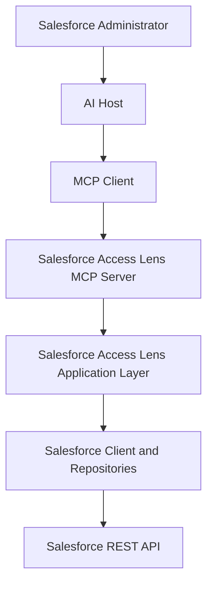
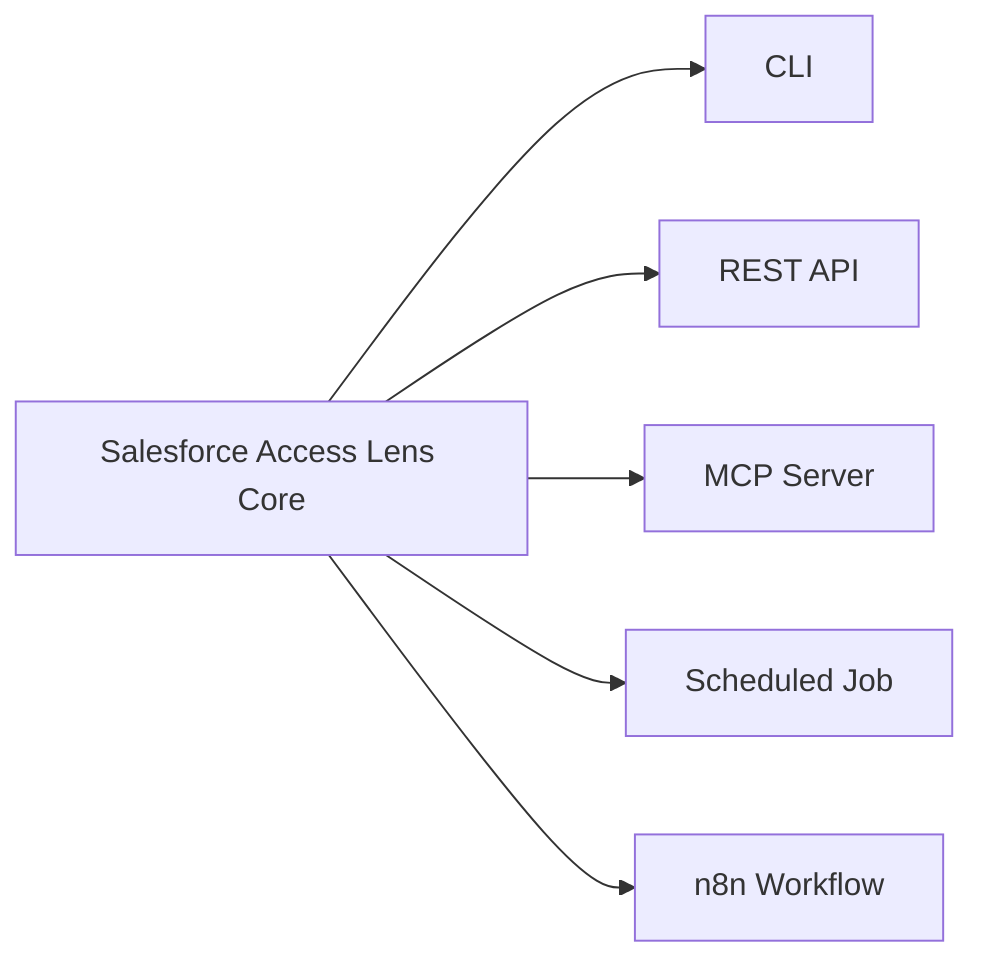
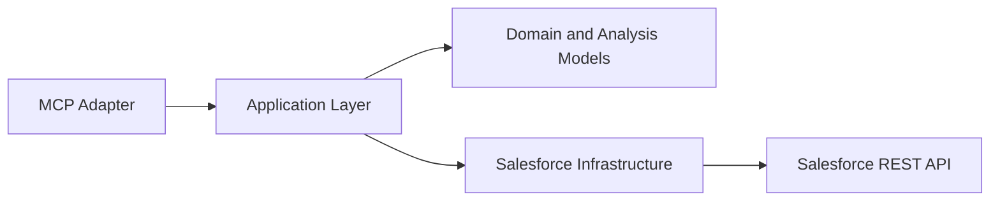
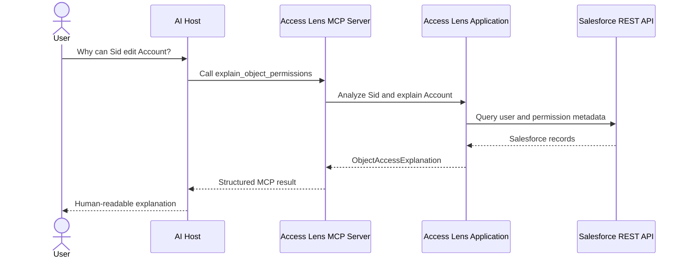

# Lesson 01: Why MCP Exists

## Lesson Status

**Completed**

## Last Reviewed

17 August 2026

This lesson is aligned with the MCP protocol revision:

```text
2026-07-28
```

## Learning Objectives

By the end of this lesson, we should be able to explain:

- what problem MCP solves;
- why Salesforce Access Lens still needs the Salesforce REST API;
- what Salesforce Access Lens adds above the Salesforce REST API;
- what MCP adds above Salesforce Access Lens;
- how MCP differs from an ordinary REST API;
- how MCP differs from provider-specific tool calling;
- what MCP does and does not standardize;
- where the MCP layer belongs in our architecture;
- why MCP business logic should remain thin;
- why our first capabilities should be exposed as MCP tools.

---

# 1. The Problem Before MCP

An AI application frequently needs access to external systems.

Examples include:

- Salesforce;
- GitHub;
- Jira;
- Slack;
- databases;
- file systems;
- calendars;
- internal enterprise applications.

Every external system exposes its capabilities differently.

One system may provide:

- a REST API;
- another may provide GraphQL;
- another may provide a Python SDK;
- another may provide a command-line interface;
- another may expose database tables;
- another may use webhooks.

Without a common integration protocol, every AI application must build
custom integration logic for every external system.

## The M × N Integration Problem

Suppose we have three AI applications:

```text
Claude Desktop
VS Code
Custom Enterprise Assistant
```

and four external systems:

```text
Salesforce
GitHub
Jira
Slack
```

Without a shared protocol, integrations may look like this:

```text
Claude Desktop ───────────────→ Salesforce
Claude Desktop ───────────────→ GitHub
Claude Desktop ───────────────→ Jira
Claude Desktop ───────────────→ Slack

VS Code ──────────────────────→ Salesforce
VS Code ──────────────────────→ GitHub
VS Code ──────────────────────→ Jira
VS Code ──────────────────────→ Slack

Enterprise Assistant ────────→ Salesforce
Enterprise Assistant ────────→ GitHub
Enterprise Assistant ────────→ Jira
Enterprise Assistant ────────→ Slack
```

Every combination may require a separate integration.

For `M` AI applications and `N` external systems, this can approach:

```text
M × N integrations
```

MCP introduces a shared protocol boundary:

```text
AI applications
       |
       | Common MCP protocol
       v
MCP servers
       |
       | System-specific integration
       v
External systems
```

Each external-system owner still has to implement the integration with
its own backend. MCP does not remove that work.

What MCP reduces is the need for every compatible AI host to learn a
completely different connection and capability-exposure mechanism.

---

# 2. What Is MCP?

MCP stands for:

```text
Model Context Protocol
```

It is an open standard for connecting AI applications to external
systems.

An MCP server can expose capabilities such as:

- executable tools;
- contextual resources;
- reusable prompt templates;
- protocol extensions supported by the server and client.

Compatible AI applications can interact with those capabilities using
the same protocol rather than requiring a completely bespoke
integration for every server.

A useful analogy is a standard connector.

The connector does not determine what the connected device does. It
standardizes how compatible systems communicate.

Similarly, MCP does not define Salesforce permission behavior. It
standardizes how an AI application can discover and invoke the
capabilities exposed by Salesforce Access Lens.

---

# 3. What the Salesforce REST API Does

Salesforce already provides APIs.

Our application uses the Salesforce REST API to:

- authenticate with Salesforce;
- execute SOQL queries;
- retrieve users;
- retrieve Profiles;
- retrieve Permission Set Assignments;
- retrieve Permission Sets;
- retrieve Object Permissions;
- retrieve Field Permissions.

For example, our application may send a query request conceptually
equivalent to:

```http
GET /services/data/v65.0/query?q=SELECT+Id,Name+FROM+User
Authorization: Bearer <access-token>
```

Salesforce returns Salesforce records.

It does not return our complete Access Lens explanation.

For example, Salesforce does not provide a single REST operation that
directly answers:

> Explain every source contributing to this user's ability to edit
> Account and present the combined result in our application model.

That interpretation belongs to Salesforce Access Lens.

---

# 4. What Salesforce Access Lens Adds

Salesforce Access Lens sits above the Salesforce REST API.

It converts Salesforce security records into application concepts that
are easier to understand and consume.

It currently performs work such as:

1. Finding a Salesforce user.
2. Finding the user's Profile.
3. Finding the user's Permission Set Assignments.
4. Retrieving the corresponding Permission Sets.
5. Retrieving Object Permissions.
6. Retrieving Field Permissions.
7. Grouping permissions under their owning Permission Sets.
8. Preserving permission provenance.
9. Combining contributions from multiple permission sources.
10. Producing structured object and field explanations.

Our domain and application models include concepts such as:

```text
PermissionSetAnalysis
ObjectPermissionSource
ObjectAccessExplanation
FieldPermissionSource
FieldAccessExplanation
UserAccessAnalysis
```

These models let consumers ask intent-based questions such as:

```python
analysis.explain_object_access("Account")
```

and:

```python
analysis.explain_field_access(
    "Account",
    "AnnualRevenue",
)
```

The consumer does not need to understand:

- Salesforce SOQL;
- Salesforce REST endpoints;
- `ParentId` relationships;
- Profile-owned Permission Sets;
- how permissions are grouped;
- how multiple permission sources are combined.

## Salesforce Access Lens Output

An object-access explanation can contain:

- the object API name;
- whether any metadata access exists;
- Read access;
- Create access;
- Edit access;
- Delete access;
- View All Records;
- Modify All Records;
- View All Fields;
- every permission source contributing to the result.

A field-access explanation can contain:

- the object API name;
- the field name;
- the complete field API name;
- Read access;
- Edit access;
- every permission source contributing to the result.

This is substantially more meaningful than returning raw Salesforce
query records.

---

# 5. What MCP Adds Above Salesforce Access Lens

Salesforce Access Lens currently exposes Python objects and methods.

For example:

```python
explanation = analysis.explain_object_access(
    "Account"
)
```

A Python caller inside our application can use that method directly.

An external AI application cannot automatically know:

- that this method exists;
- what arguments it accepts;
- what those arguments mean;
- what result it returns;
- how to connect to the Python process;
- how errors are represented;
- which other capabilities are available.

The MCP server provides that AI-facing boundary.

It can expose a tool conceptually like:

```text
Name:
explain_object_permissions

Inputs:
username
object_name

Output:
object permission explanation
permission sources
```

An MCP-compatible AI host can then:

1. learn that the tool exists;
2. understand its input schema;
3. decide whether it is relevant;
4. invoke it through its MCP client;
5. receive structured output;
6. use that output in its response to the user.

## Complete Layered Architecture



Each layer solves a different problem.

| Layer | Responsibility |
|---|---|
| Salesforce REST API | Expose Salesforce data and operations |
| Infrastructure layer | Authenticate, query, map, and retrieve Salesforce records |
| Application/domain layer | Interpret and explain Salesforce permission data |
| MCP server | Expose selected application capabilities through MCP |
| MCP client | Communicate with the MCP server |
| AI host | Coordinate the user, model, clients, approvals, and results |

---

# 6. MCP Does Not Replace the Salesforce REST API

MCP and the Salesforce REST API are not alternatives.

They exist at different boundaries.

```text
Salesforce REST API
        |
        | Salesforce data
        v
Salesforce Access Lens
        |
        | Permission explanations
        v
MCP Server
        |
        | Standardized AI-facing capabilities
        v
AI Applications
```

Our MCP tool will not query Salesforce magically.

The execution path will still be:

```text
MCP Tool
   ↓
AccessLensService
   ↓
Salesforce repositories
   ↓
SoqlQueryExecutor
   ↓
SalesforceClient
   ↓
Salesforce REST API
```

MCP standardizes the upper integration boundary. It does not remove the
lower Salesforce integration.

---

# 7. REST API Compared with MCP

MCP is not simply a replacement for REST.

A normal REST API remains an excellent interface for general
application-to-application communication.

MCP specifically provides an AI-oriented protocol for exposing
capabilities and context.

| Concern | Ordinary REST API | MCP |
|---|---|---|
| Primary purpose | General software integration | Connecting AI applications to external capabilities |
| Interface | Application-specific endpoints | Standard protocol operations and primitives |
| Capability discovery | Usually separate documentation or OpenAPI | Supported through MCP discovery and list operations |
| Invocation | Custom HTTP request designed by API owner | Standard MCP operation such as a tool call |
| Input description | API documentation or OpenAPI schema | Tool input schema |
| Output | Application-specific HTTP response | MCP result with structured and/or content blocks |
| Client behavior | Custom integration code | Reusable MCP client implementation |
| AI awareness | Added by the consuming application | Designed around AI-host capability consumption |
| Backend protocol | Commonly HTTP | Can use standard MCP transports such as Streamable HTTP or stdio |
| Relevance to Access Lens | Possible future adapter | Our selected AI-facing adapter |

## Could We Still Build a REST API?

Yes.

Salesforce Access Lens could eventually support:

```text
CLI adapter
REST adapter
MCP adapter
Scheduled job
n8n integration
```

All of them can use the same application layer.



This is why MCP logic must not be inserted directly into our domain
models.

---

# 8. MCP Compared with Tool Calling

Tool calling and MCP are related but different.

## Tool Calling

Tool calling is generally a model or AI-platform capability.

The application provides a collection of function definitions to the
model. The model may select one of those functions and produce
arguments for it.

Without MCP, the application developer is responsible for:

- registering every function;
- connecting it to the implementation;
- managing credentials;
- defining schemas;
- handling invocation;
- converting results;
- repeating this integration for every application.

## MCP

MCP standardizes how an external server exposes capabilities to
compatible AI applications.

A host can obtain the server's capability definitions and invoke them
through MCP.

The relationship is:

```text
MCP exposes and transports capabilities.
The host/model may decide when a tool should be called.
```

MCP does not replace the model's reasoning about whether a tool is
useful.

It creates a reusable boundary through which tools and other
capabilities are made available.

---

# 9. What MCP Standardizes

MCP provides common protocol structures for areas such as:

- identifying protocol operations;
- describing tools;
- defining tool input schemas;
- invoking tools;
- returning structured or unstructured content;
- listing and reading resources;
- listing and obtaining prompts;
- representing errors;
- communicating supported protocol metadata;
- transporting messages through supported transports;
- supporting optional extensions.

The exact features depend on the MCP protocol revision and the
capabilities implemented by the client and server.

---

# 10. What MCP Does Not Standardize

MCP does not define:

- how Salesforce permissions work;
- how JWT Bearer authentication works;
- which SOQL queries should be executed;
- how Profile permissions are combined;
- how Permission Set Groups should be resolved;
- how Muting Permission Sets affect results;
- whether a user can access a particular Salesforce record;
- our business terminology;
- our application's security policy;
- our tool authorization rules;
- where Salesforce credentials are stored;
- whether a particular user is permitted to inspect another user's
  permissions.

Those are application and security decisions.

---

# 11. MCP Is Not an LLM

MCP does not reason about Salesforce permissions.

The language model may reason about:

- the user's question;
- whether an Access Lens tool is relevant;
- how to explain the returned result.

Our deterministic Python application remains responsible for
calculating the permission explanation.

```text
Language model:
Understands the question and uses the result.

Salesforce Access Lens:
Calculates the permission result.

MCP:
Connects the two sides through a standard protocol.
```

---

# 12. MCP Is Not an Agent

An agent may:

- plan multiple steps;
- choose tools;
- inspect results;
- revise its plan;
- continue until a goal is achieved.

MCP provides connectivity and capability exposure. It does not itself
perform that planning loop.

An agent can use MCP, but MCP is not the agent.

---

# 13. MCP Is Not a Database

MCP does not store Salesforce metadata for us.

Our server may later introduce:

- caching;
- audit storage;
- analysis snapshots;
- a database.

Those would be application infrastructure choices, not intrinsic MCP
behavior.

---

# 14. MCP Is Not a Workflow Engine

A workflow engine such as n8n coordinates multi-step automations.

For example:

```text
Every Monday
    ↓
Analyze Salesforce administrators
    ↓
Generate a report
    ↓
Post the report to Slack
    ↓
Create Jira issues for unexpected access
```

MCP can expose the Access Lens capability used by that workflow.

n8n can orchestrate when and how the capability is used.

Therefore:

```text
MCP = capability interface
n8n = workflow orchestration
```

Our native Python MCP server should remain the authoritative
AI-facing adapter. n8n can become a consumer or orchestrator later.

---

# 15. The Thin MCP Adapter Principle

Our MCP layer should be thin.

## The MCP Layer Should

- declare tools;
- describe tools clearly;
- define input schemas;
- validate protocol-facing input;
- invoke the application layer;
- translate application results into MCP results;
- translate expected application failures into useful errors;
- log invocation and operational information safely;
- enforce MCP-facing authentication and authorization when deployed.

## The MCP Layer Should Not

- construct SOQL directly;
- query Salesforce repositories directly when an application service
  already owns the use case;
- calculate effective permissions;
- inspect raw `ObjectPermission` lists;
- duplicate `ObjectAccessExplanation`;
- duplicate `FieldAccessExplanation`;
- know how JWT assertions are generated;
- format all business results only as terminal text;
- expose Salesforce access tokens.

## Desired Dependency Direction



Dependencies should not point backwards:

```text
Domain model ─X→ MCP
Repository   ─X→ MCP
SalesforceClient ─X→ MCP
```

---

# 16. Why Structured Application Objects Matter

We deliberately created objects such as:

```text
ObjectAccessExplanation
FieldAccessExplanation
ObjectPermissionSource
FieldPermissionSource
```

instead of returning only formatted strings.

That decision allows multiple adapters to render the same result.

For example:

```text
ObjectAccessExplanation
├── Terminal text
├── JSON
├── MCP structured result
├── REST response
└── HTML report
```

If the domain layer returned only a terminal-formatted string, the MCP
adapter would have to parse or reconstruct information that the
application already knew.

Structured objects preserve meaning.

---

# 17. Initial Salesforce Access Lens MCP Tools

Our first planned tools are conceptually:

```text
explain_object_permissions
explain_field_permissions
```

## Object Tool Input

```text
username
object_name
```

Example:

```json
{
  "username": "sid@example.com",
  "object_name": "Account"
}
```

## Field Tool Input

```text
username
object_name
field_name
```

Example:

```json
{
  "username": "sid@example.com",
  "object_name": "Account",
  "field_name": "AnnualRevenue"
}
```

## Example Structured Object Result

```json
{
  "username": "sid@example.com",
  "object_name": "Account",
  "has_access": true,
  "permissions": {
    "read": true,
    "create": true,
    "edit": true,
    "delete": true,
    "view_all_records": true,
    "modify_all_records": true,
    "view_all_fields": true
  },
  "sources": [
    {
      "source_name": "System Administrator",
      "source_type": "profile",
      "can_read": true,
      "can_create": true,
      "can_edit": true,
      "can_delete": true
    },
    {
      "source_name": "Access Lens Account Reader",
      "source_type": "permission_set",
      "can_read": true,
      "can_create": false,
      "can_edit": false,
      "can_delete": false
    }
  ]
}
```

This is an illustrative target shape, not yet the committed transport
contract.

We will design the final result model before exposing it publicly.

---

# 18. Why We Currently Say “Metadata Permissions”

Our current application analyzes metadata-level permissions obtained
from Profiles and assigned Permission Sets.

It does not yet fully include:

- Permission Set Groups;
- Muting Permission Sets;
- record-level sharing;
- Organization-Wide Defaults;
- role hierarchy;
- sharing rules;
- manual sharing;
- account and opportunity teams;
- territories;
- restriction rules;
- scoping rules;
- record-specific `UserRecordAccess`.

Therefore, our MCP tool names and descriptions must not overstate what
the engine currently knows.

For the first MCP version, wording such as:

```text
Explain the user's object permissions from currently supported
Profile and Permission Set sources.
```

is more honest than:

```text
Tell me whether this user can access every Account record.
```

Tool descriptions form part of the product contract.

---

# 19. Example End-to-End Question

The user asks:

> Why can Sid edit Account?

The conceptual flow is:



The MCP server does not calculate the access itself. It delegates to
the Access Lens application layer.

---

# 20. Architectural Decisions from This Lesson

We have decided:

1. Salesforce Access Lens will continue using the Salesforce REST API.
2. MCP will not replace our Salesforce client or repositories.
3. MCP will be implemented as an outer adapter.
4. Permission-resolution rules will remain outside the MCP package.
5. MCP handlers will call application services rather than raw
   repositories.
6. Explanation objects will be converted into structured results.
7. The first MCP interface will focus on object and field permission
   explanations.
8. Tool descriptions will accurately state the security layers
   currently supported.
9. n8n will be considered later as an orchestrator or consumer, not as
   the core MCP implementation.
10. Access Resolution Engine improvements and Permission Set Groups can
    be added later without redesigning the MCP boundary.

---

# 21. Knowledge Check

## Question

What does Salesforce Access Lens add above the Salesforce REST API,
and what does MCP add above Salesforce Access Lens?

## Answer

Salesforce Access Lens uses the Salesforce REST API to retrieve
Salesforce security data. It interprets that data, preserves the
relationship between permissions and their sources, combines
contributing permissions, and produces structured object-access and
field-access explanations.

The MCP server then exposes those existing application capabilities
through a standard protocol so compatible AI applications can discover
and invoke them without implementing a custom Access Lens integration.

---

# 22. Key Takeaway

```text
Salesforce REST API provides the data.

Salesforce Access Lens provides the meaning.

MCP provides the standardized AI-facing connection.
```

---

# References

- [What is the Model Context Protocol?](https://modelcontextprotocol.io/docs/getting-started/intro)
- [MCP 2026-07-28 release](https://blog.modelcontextprotocol.io/posts/2026-07-28/)
- [MCP server concepts](https://modelcontextprotocol.io/specification/2025-06-18/server/index)

The protocol evolves quickly. Before implementing protocol-specific
behavior, verify it against the current specification and the version
supported by the selected SDK.