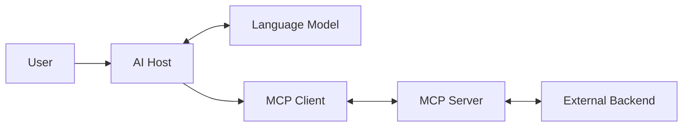
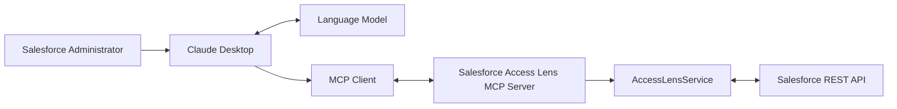
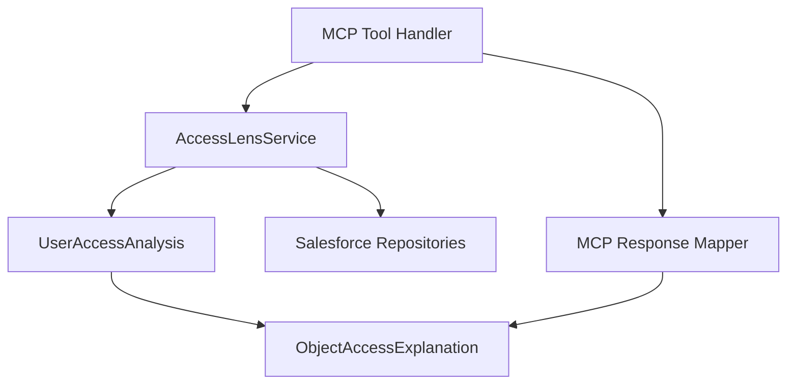
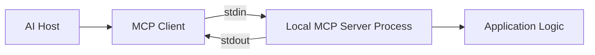
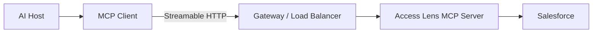
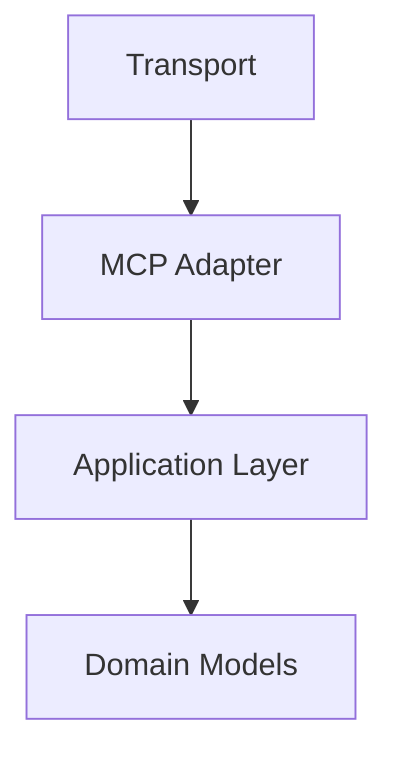
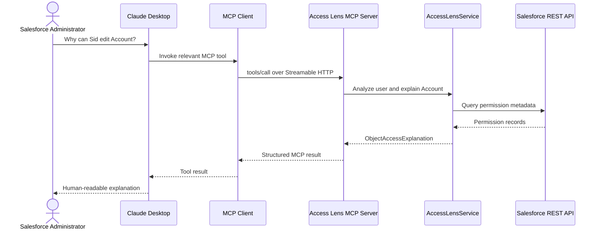

# Lesson 02: MCP Host, Client, Server, and Transport

## Lesson Status

**Completed**

## Last Reviewed

17 August 2026

This lesson is aligned with the MCP protocol revision:

```text
2026-07-28
```

## Learning Objectives

By the end of this lesson, we should be able to:

- distinguish the AI host from the language model;
- explain where the MCP client lives;
- explain what the MCP server owns;
- explain what a transport does;
- distinguish the MCP protocol from its transport;
- compare `stdio`, Streamable HTTP, and legacy HTTP+SSE;
- map every MCP component to Salesforce Access Lens;
- trace a request from the user to Salesforce and back;
- identify the security boundaries between hosts and servers;
- explain why our business logic must remain transport-independent;
- understand the effect of the stateless MCP `2026-07-28` core.

---

# 1. High-Level Architecture

MCP uses a host-client-server architecture.



In Salesforce Access Lens:



These components must not be treated as interchangeable.

---

# 2. The User

The user is the person interacting with the AI application.

For Salesforce Access Lens, the user may be:

- a Salesforce administrator;
- a Salesforce developer;
- a security auditor;
- a support engineer;
- a technical lead;
- an identity and access management specialist.

The user may ask:

> Why can this user edit Account?

The user does not need to know:

- how the MCP protocol works;
- how the MCP client connects;
- which Salesforce queries are executed;
- how permission sources are grouped.

Those details are hidden behind the application.

---

# 3. The Language Model

The language model interprets the user's request.

It may reason that a Salesforce permission tool would help answer the
question.

The model may help decide:

- which tool is relevant;
- what arguments should be supplied;
- how the result should be explained;
- whether another tool call is needed.

The model does not itself establish the network connection to our MCP
server.

The host manages the model and the MCP clients.

## Important Distinction

```text
Model = reasoning component

Host = application coordinating the complete experience
```

Casually saying “the model calls the tool” can be convenient, but the
technical flow is managed by the host through its MCP client.

---

# 4. MCP Host

The host is the complete AI application the user interacts with.

Examples may include:

- Claude Desktop;
- an MCP-compatible IDE;
- a custom enterprise assistant;
- a developer tool with MCP support;
- an automation or agent application implementing an MCP client.

## Host Responsibilities

The host may be responsible for:

- managing the user interface;
- managing the conversation;
- communicating with the language model;
- creating and managing MCP clients;
- configuring available MCP servers;
- applying security policies;
- asking for user approval;
- deciding what context is presented to the model;
- aggregating results from multiple servers;
- presenting results to the user;
- protecting one server from another server's private context.

## The Host Is a Trust Boundary

The host decides what information each connected server receives.

An MCP server should not automatically receive:

- the entire conversation;
- data from every other MCP server;
- all files accessible to the host;
- all user credentials;
- unrestricted control of the host.

The host should provide only the information required for the
requested operation.

## Salesforce Access Lens Mapping

If Claude Desktop connects to Salesforce Access Lens:

```text
Host = Claude Desktop
```

Salesforce Access Lens is not the host.

---

# 5. MCP Client

The MCP client is the protocol component used by the host to
communicate with an MCP server.

The client is generally created or managed by the host.

Conceptually:

```text
Claude Desktop
├── MCP Client → Salesforce Access Lens
├── MCP Client → GitHub
└── MCP Client → Jira
```

Each client is associated with one logical server connection or server
relationship.

In a horizontally scaled HTTP deployment, that logical server may be
implemented by multiple physical server instances behind a load
balancer.

Therefore:

```text
One logical client-to-server relationship
does not necessarily mean
one permanent connection to one physical machine.
```

## Client Responsibilities

Depending on the protocol revision and implementation, the client may:

- connect to or address the server;
- discover server capabilities;
- list available tools, resources, and prompts;
- send tool invocations;
- read resources;
- obtain prompts;
- receive results;
- handle protocol errors;
- send client identity and supported capability metadata;
- participate in authorization;
- cache capability lists according to server-provided hints;
- handle multi-round-trip input requests when supported.

## Current Protocol Note

In older MCP revisions, clients and servers performed a mandatory
initialization handshake and could establish a protocol-level session.

In MCP `2026-07-28`:

- the mandatory `initialize`/`initialized` handshake was removed;
- protocol-level sessions were removed;
- the `Mcp-Session-Id` header was removed;
- requests are self-describing;
- server discovery is available but optional;
- protocol version and relevant client metadata travel with requests.

This makes remote MCP workloads easier to scale across ordinary HTTP
infrastructure.

## Salesforce Access Lens Mapping

When Claude Desktop connects to our server:

```text
MCP client = the MCP protocol component managed by Claude Desktop
```

We are not building that client as part of Salesforce Access Lens.

We are building a server that compatible clients can call.

---

# 6. MCP Server

An MCP server exposes focused capabilities from an application or
external system.

Servers may expose primitives such as:

- tools;
- resources;
- prompts.

They may also support applicable protocol extensions.

## Server Responsibilities

Our MCP server will be responsible for:

- defining supported capabilities;
- declaring tool names;
- writing accurate tool descriptions;
- defining tool input schemas;
- validating arguments;
- invoking Salesforce Access Lens application services;
- mapping application objects to structured output;
- returning protocol-compliant results;
- returning useful errors;
- enforcing server-side authorization;
- protecting Salesforce credentials;
- logging safely;
- respecting rate limits and downstream failures.

## Server Non-Responsibilities

Our MCP server should not:

- contain SOQL strings;
- construct Salesforce JWT assertions;
- duplicate repository logic;
- directly recompute permission explanations;
- expose Salesforce access tokens;
- trust usernames without authorization checks in production;
- assume the AI model's output is always valid;
- rely on the transport for business behavior.

## Salesforce Access Lens Mapping

```text
MCP server = the Python adapter we build around Salesforce Access Lens
```

The server calls the existing application layer.



The exact mapping direction may be refined when we design our adapter,
but the MCP layer must consume the application result rather than
reimplement it.

---

# 7. Backend System

The MCP server is often an adapter around another system.

Examples include:

```text
GitHub MCP Server → GitHub API
Database MCP Server → Database
Filesystem MCP Server → Local files
Salesforce Access Lens MCP Server → Access Lens → Salesforce API
```

In our architecture, Salesforce is the downstream backend.

```text
Salesforce is not the MCP server.

Salesforce Access Lens is not the Salesforce API.

The MCP server is an adapter around our Access Lens application.
```

---

# 8. What Is a Transport?

A transport determines how MCP protocol messages move between client
and server.

The transport answers:

> How are protocol messages delivered?

It does not answer:

> What does the tool do?

The tool behavior belongs to the server and application layer.

## Protocol Compared with Transport

```text
Protocol:
Defines the meaning and structure of messages.

Transport:
Carries those messages between participants.
```

An analogy:

```text
Protocol = language and grammar
Transport = telephone, letter, or video call
```

The language can remain the same while the communication channel
changes.

## MCP Message Encoding

MCP uses JSON-RPC structures for protocol requests and responses.

A conceptual tool invocation may look like:

```json
{
  "jsonrpc": "2.0",
  "id": 1,
  "method": "tools/call",
  "params": {
    "name": "explain_object_permissions",
    "arguments": {
      "username": "sid@example.com",
      "object_name": "Account"
    }
  }
}
```

The SDK will construct and parse protocol messages for us.

We should understand the shape, but we should not manually build
JSON-RPC messages unless working at the low-level protocol layer.

---

# 9. Standard Input/Output Transport

With `stdio`, the MCP server runs as a local child process.

The client launches the process.

Messages travel through:

```text
Client writes → Server standard input
Server writes → Client through standard output
```

## `stdio` Architecture



## Advantages

- simple local setup;
- no listening network port;
- the host controls the server process;
- useful for local development;
- useful for local filesystem or developer-tool integrations;
- network authentication may not be necessary for a strictly local
  process.

## Limitations

- normally tied to the machine running the host;
- the host must be able to start the process;
- not naturally suited to a centrally hosted multi-user service;
- process management belongs to the client/host;
- remote access requires another mechanism.

## Logging Warning

For `stdio` servers:

```text
stdout is reserved for MCP protocol messages.
```

Writing arbitrary debugging text to standard output can corrupt the
protocol stream.

Logs should be written to standard error or through an appropriate
logging mechanism.

For example, this can be dangerous in a `stdio` server:

```python
print("Starting server")
```

if it writes non-protocol output to `stdout`.

Our initial transport is not `stdio`, but this is important MCP
knowledge.

---

# 10. Streamable HTTP Transport

Streamable HTTP allows the MCP server to run as an independent HTTP
service.

The client addresses an MCP endpoint, commonly shaped like:

```text
https://access-lens.example.com/mcp
```

## Architecture



## Why It Fits Salesforce Access Lens

Our long-term goal is not limited to one local desktop process.

We may want:

- centralized deployment;
- access from multiple approved clients;
- authentication and authorization;
- audit logging;
- controlled Salesforce credentials;
- load balancing;
- monitoring;
- network-level policies;
- future n8n integration.

Streamable HTTP is a natural transport for that direction.

## Streamable HTTP Does Not Mean Business REST API

Although Streamable HTTP uses HTTP, our MCP endpoint is not simply an
ordinary custom REST endpoint such as:

```http
POST /users/{username}/objects/{objectName}/explanation
```

Instead, the HTTP transport carries MCP protocol operations such as:

```text
tools/list
tools/call
resources/list
resources/read
prompts/list
prompts/get
```

The server and client still communicate according to MCP.

---

# 11. Current Stateless Protocol Core

MCP `2026-07-28` introduced a stateless protocol core.

## Earlier Approach

Earlier revisions commonly involved:

```text
Initialize
    ↓
Establish protocol session
    ↓
Receive session identifier
    ↓
Include session identifier in later requests
```

That design created deployment concerns such as:

- session affinity;
- sticky load-balancer routing;
- shared session storage;
- recovery when a server instance disappeared.

## Current Approach

In `2026-07-28`, requests are self-contained.

A request carries relevant metadata such as:

- protocol version;
- client identity information;
- client capabilities where applicable;
- operation name;
- target tool, resource, or prompt information.

Discovery can be performed when needed, but the old mandatory
initialization handshake is no longer required.

Conceptually:

```text
Request 1 → Any healthy server instance
Request 2 → Any healthy server instance
Request 3 → Any healthy server instance
```

No hidden protocol session has to pin all three requests to the same
physical server instance.

## Application State Is Still Possible

Stateless MCP does not mean our entire application can never maintain
state.

It means the protocol does not hide cross-request application state in
a transport session.

If a future tool needs persistent state, the application can use an
explicit handle.

For example:

```json
{
  "analysis_handle": "analysis-123"
}
```

A later tool call can pass that handle explicitly.

For our first Access Lens tools, we do not need cross-call state.

Each explanation request can:

1. receive the username and permission target;
2. query Salesforce;
3. build the explanation;
4. return the result.

That naturally fits stateless operation.

---

# 12. HTTP Headers in the Current Transport

Current Streamable HTTP requests identify relevant routing information
through headers.

Important examples include:

```text
MCP-Protocol-Version
Mcp-Method
Mcp-Name
```

Conceptually:

```http
POST /mcp HTTP/1.1
MCP-Protocol-Version: 2026-07-28
Mcp-Method: tools/call
Mcp-Name: explain_object_permissions
Content-Type: application/json
```

This allows infrastructure such as:

- gateways;
- load balancers;
- Web Application Firewalls;
- rate limiters;
- observability systems;

to identify the MCP operation without deeply parsing the request body.

Our SDK should handle protocol-compliant request construction and
validation. We should not manually recreate this transport behavior
unless required.

---

# 13. Legacy HTTP+SSE Compared with Streamable HTTP

The original remote MCP transport used separate HTTP and Server-Sent
Events behavior.

Streamable HTTP replaced that legacy HTTP+SSE transport.

## Simplified Evolution

| Period | Remote transport direction |
|---|---|
| Earlier MCP | HTTP+SSE |
| Later 2025 revisions | Streamable HTTP with optional session behavior |
| MCP 2026-07-28 | Stateless Streamable HTTP core |

SSE may still appear in:

- old tutorials;
- older clients;
- older SDK examples;
- compatibility implementations;
- optional streaming mechanisms.

However, legacy HTTP+SSE should not be selected for a new server merely
because an older tutorial uses it.

## Our Decision

```text
Selected: Streamable HTTP

Not selected: legacy HTTP+SSE

Not selected initially: stdio
```

This decision supports the network-accessible server goal while
following the current protocol direction.

---

# 14. Transport Independence

Our application logic should behave identically regardless of its
delivery transport.

This call:

```python
analysis.explain_object_access("Account")
```

must not know whether the caller is:

- `main.py`;
- a unit test;
- a CLI;
- a REST adapter;
- an MCP server using `stdio`;
- an MCP server using Streamable HTTP.

## Correct Dependency Direction



## Incorrect Dependency Direction

```text
ObjectAccessExplanation
    ↓ imports
Streamable HTTP implementation
```

That would couple business logic to delivery infrastructure.

---

# 15. Complete Request Flow

Suppose the user asks:

> Why can Sid edit Account?

The detailed flow is:

1. The Salesforce administrator enters the question in Claude Desktop.
2. Claude Desktop acts as the host.
3. The host makes the available tool descriptions accessible to the
   language model.
4. The model determines that the Access Lens object-permission tool is
   relevant.
5. The host's MCP client constructs an MCP tool-call request.
6. Streamable HTTP carries the request to our MCP endpoint.
7. The MCP server verifies the protocol request.
8. The tool handler validates `username` and `object_name`.
9. The handler calls the Salesforce Access Lens application layer.
10. `AccessLensService` coordinates the repositories.
11. The repositories execute Salesforce queries.
12. Salesforce returns permission records.
13. Access Lens builds `PermissionSetAnalysis` objects.
14. `UserAccessAnalysis` creates an `ObjectAccessExplanation`.
15. The MCP adapter maps that explanation into a structured result.
16. The server returns the result through Streamable HTTP.
17. The MCP client delivers the result to the host.
18. The host/model presents an understandable explanation to the user.

## Sequence Diagram



---

# 16. Result Flow

The result travels through the layers in reverse:

```text
Salesforce records
        ↓
Mapped domain objects
        ↓
PermissionSetAnalysis
        ↓
ObjectAccessExplanation
        ↓
MCP response mapper
        ↓
Structured MCP tool result
        ↓
MCP client
        ↓
AI host
        ↓
User-facing explanation
```

Each layer adds or transforms meaning.

---

# 17. Error Flow

Failures also cross architectural boundaries.

Examples include:

- Salesforce authentication failure;
- expired or invalid access token;
- Salesforce API unavailable;
- API limit exceeded;
- unknown Salesforce user;
- invalid object API name;
- invalid field API name;
- MCP input-schema violation;
- unauthorized caller;
- internal server error.

The MCP adapter should not expose sensitive implementation details.

For example, it should not leak:

- Salesforce access tokens;
- private-key paths;
- raw credentials;
- internal stack traces;
- secrets from environment variables.

The server should convert known application errors into safe,
actionable MCP errors.

Detailed error design will be covered in a later production lesson.

---

# 18. Security Boundaries

## Host Boundary

The host decides:

- which MCP servers are configured;
- what context is sent to each server;
- whether tool invocation requires user approval;
- how tool results are shown to the model and user.

## Client Boundary

The client handles protocol communication with its associated server.

It should not automatically merge private information from unrelated
servers.

## MCP Server Boundary

Our server must decide:

- who may connect;
- who may inspect Salesforce users;
- which Salesforce org may be queried;
- which tools a caller may invoke;
- what audit information is recorded;
- what output is safe to return.

## Salesforce Boundary

Salesforce itself enforces the privileges of the integration user used
by Access Lens.

The MCP server cannot retrieve Salesforce information that its
Salesforce integration identity is not permitted to access.

## Important Production Question

If a caller asks:

```text
Explain the permissions of another Salesforce user
```

the MCP server must not assume that every authenticated caller is
authorized to perform that inspection.

Authentication answers:

> Who is calling?

Authorization answers:

> Is that caller allowed to analyze this Salesforce user?

We will design this before remote production deployment.

---

# 19. Deployment Topologies

## Local `stdio`

```text
Claude Desktop
    └── Starts local Access Lens MCP process
            └── Calls Salesforce
```

Useful for:

- individual development;
- local experimentation;
- avoiding a remote deployment.

## Local Streamable HTTP

```text
Claude Desktop
    └── http://localhost:<port>/mcp
            └── Local Access Lens server
                    └── Salesforce
```

Useful for:

- learning the remote transport model;
- testing with MCP Inspector;
- preparing for deployment.

This is our initial development topology.

## Remote Streamable HTTP

```text
AI Host
    ↓ HTTPS
API Gateway / Identity Layer
    ↓
Access Lens MCP Server
    ↓
Salesforce
```

Useful for:

- centralized service operation;
- multiple approved users;
- auditing;
- production monitoring;
- n8n or other remote consumers.

Remote deployment introduces additional requirements:

- TLS;
- authentication;
- authorization;
- secret management;
- rate limiting;
- logging;
- tracing;
- safe error handling;
- deployment health checks;
- Salesforce request-limit awareness.

We will not treat a locally working server as production-ready.

---

# 20. Component Responsibility Table

| Component | Owns | Does not own |
|---|---|---|
| User | Business question | Protocol details |
| AI host | User experience, model, clients, approvals | Salesforce permission calculations |
| Language model | Reasoning and tool selection | Network transport implementation |
| MCP client | MCP communication with a server | Salesforce domain logic |
| Transport | Delivery of MCP messages | Tool behavior |
| MCP server | Capability exposure and adapter behavior | Salesforce's internal API |
| Access Lens application | Permission analysis and explanations | MCP wire protocol |
| Salesforce client | Salesforce HTTP communication | AI interaction |
| Salesforce REST API | Salesforce data and operations | Access Lens explanation model |

---

# 21. Common Misunderstandings

## “Claude is the MCP client”

Claude Desktop is the host.

An MCP client component inside the host communicates with our server.

## “The model opens the HTTP connection”

The host and its MCP client manage protocol communication.

## “The MCP server is Salesforce”

Our Python application provides the MCP server.

Salesforce remains the backend system.

## “Streamable HTTP calculates the tool result”

Streamable HTTP only carries protocol messages.

The Access Lens application layer calculates the result.

## “Using HTTP makes this an ordinary REST API”

The transport uses HTTP, but the messages and operations follow MCP.

## “Every client has a permanent stateful session”

That was characteristic of older protocol revisions.

MCP `2026-07-28` has a stateless protocol core.

## “Stateless means the application cannot use a database”

Stateless protocol operation does not prohibit application persistence.

State should be represented explicitly rather than hidden in a
protocol session.

## “Changing transport requires rewriting the permission engine”

A clean architecture keeps permission logic independent of transport.

## “The server sees the full conversation”

The server should receive only the context and arguments supplied
through the protocol operation. The host controls broader conversation
context.

---

# 22. Salesforce Access Lens Decisions from This Lesson

We have decided:

1. Salesforce Access Lens will act as the MCP server.
2. The consuming AI application will act as the host.
3. The host will manage its own MCP client.
4. We will not build a custom MCP client during the initial server
   phase.
5. We will use Streamable HTTP.
6. We will not use legacy HTTP+SSE for a new implementation.
7. We will test locally before considering remote deployment.
8. The first tools will be stateless.
9. MCP transport code will remain outside our application and domain
   models.
10. The server will call the application layer rather than raw
    repositories.
11. Salesforce credentials will remain server-side.
12. Production authentication and authorization will be designed
    before exposing the server remotely.
13. Current SDK documentation will take precedence over older video
    tutorials.
14. We will use MCP Inspector to test and understand the server before
    connecting a full AI host.

---

# 23. Knowledge Check

Assume Claude Desktop connects to Salesforce Access Lens using
Streamable HTTP.

## Question 1

What is the host?

## Answer

Claude Desktop is the host. It manages the user experience, language
model interaction, connected MCP clients, approvals, and presentation
of results.

## Question 2

Where is the MCP client?

## Answer

The MCP client is a protocol component managed inside Claude Desktop.
It communicates with the Salesforce Access Lens MCP server.

## Question 3

What is the MCP server?

## Answer

The MCP server is the Python adapter we build around Salesforce Access
Lens. It exposes Access Lens capabilities through MCP and delegates
permission analysis to the existing application layer.

## Question 4

What does Streamable HTTP do?

## Answer

Streamable HTTP carries MCP protocol messages between the MCP client
and server over HTTP. It does not calculate permissions or define tool
behavior.

---

# 24. Key Takeaway

```text
The host coordinates the AI experience.

The client speaks MCP on behalf of the host.

The server exposes focused capabilities.

The transport carries protocol messages.

Salesforce Access Lens calculates the permission explanation.
```

---

# References

- [MCP architecture](https://modelcontextprotocol.io/specification/2025-06-18/architecture)
- [MCP 2026-07-28 release](https://blog.modelcontextprotocol.io/posts/2026-07-28/)
- [MCP Streamable HTTP transport background](https://modelcontextprotocol.io/specification/2025-06-18/basic/transports)
- [HTTP header standardization](https://modelcontextprotocol.io/seps/2243-http-standardization)
- [Current MCP introduction](https://modelcontextprotocol.io/docs/getting-started/intro)

The protocol evolves quickly. Older architecture and transport pages
may describe pre-2026 initialization and session behavior. For new
implementation work, verify protocol-specific details against the
current SDK and the `2026-07-28` specification.