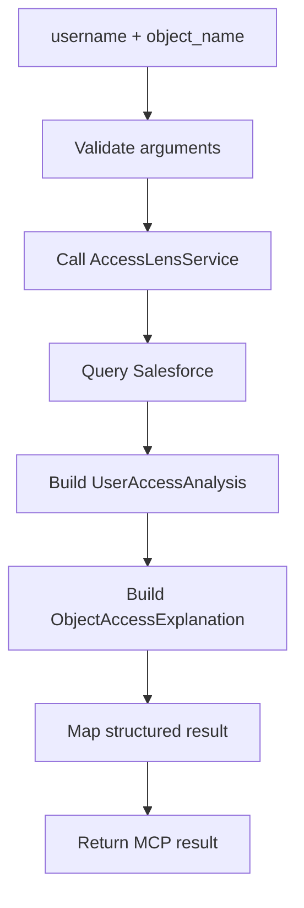
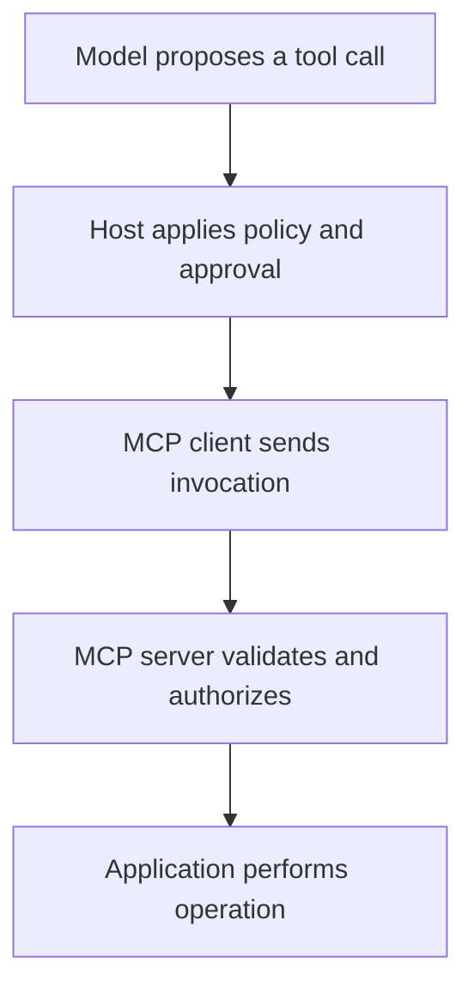
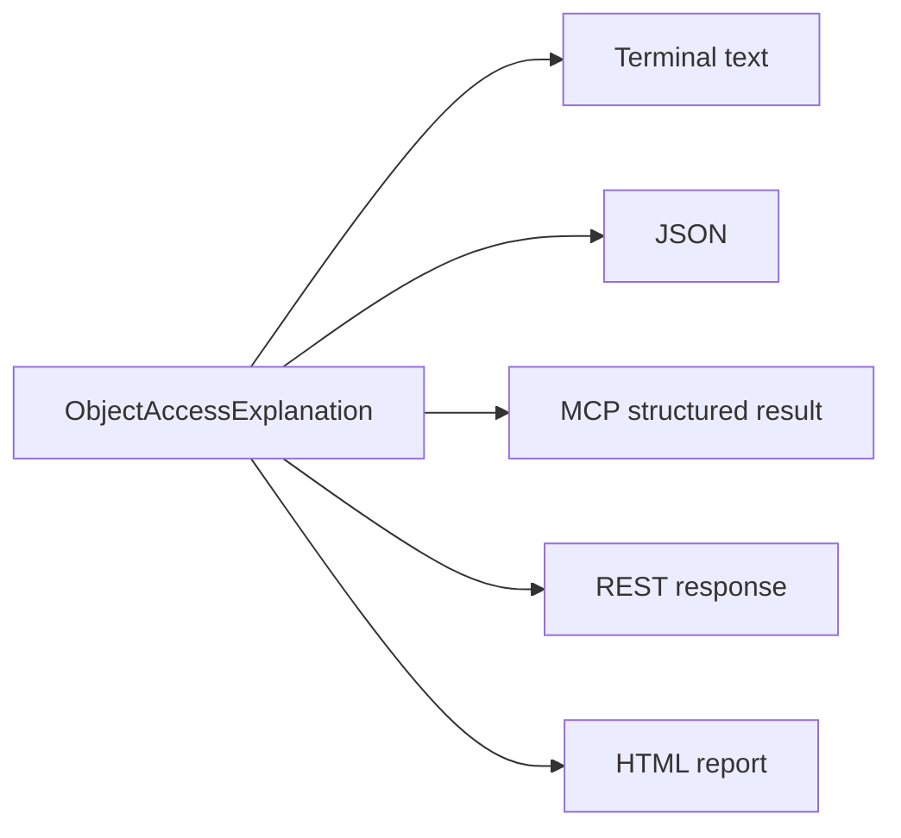
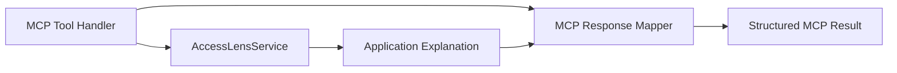
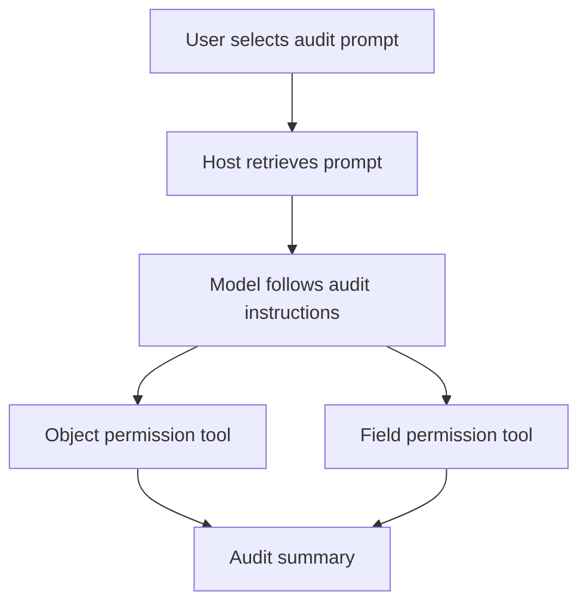
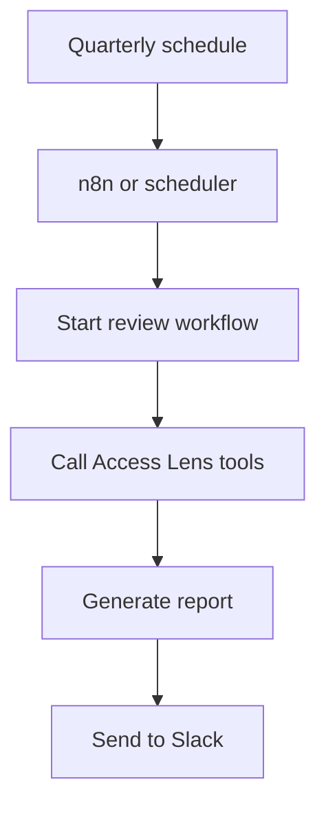
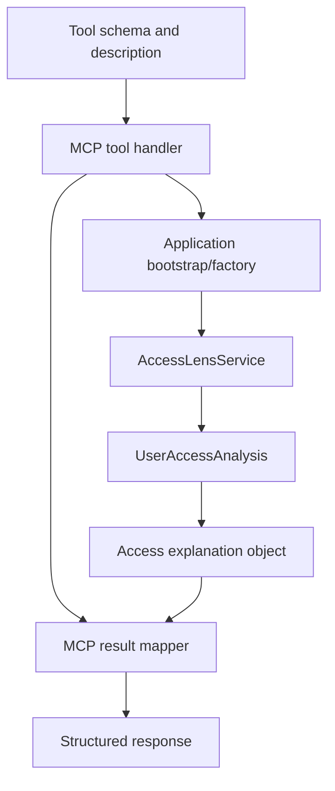

# Lesson 03: Tools, Resources, and Prompts

## Lesson Status

**Completed**

## Last Reviewed

17 August 2026

This lesson is aligned with MCP protocol revision:

```text
2026-07-28
```

## Learning Objectives

By the end of this lesson, we should be able to:

- identify the three principal MCP server primitives;
- explain the responsibility of tools;
- explain the responsibility of resources;
- explain the responsibility of prompts;
- understand their typical control patterns;
- distinguish executable behavior from contextual information;
- distinguish reusable instructions from automation;
- classify Salesforce Access Lens capabilities correctly;
- explain why our first MCP capabilities should be tools;
- understand why structured tool output matters;
- separate MCP handlers from application logic;
- recognize the security implications of read-only and mutating tools.

---

# 1. Why MCP Has Multiple Primitives

Not every capability exposed by an MCP server has the same
responsibility.

Consider these requirements:

1. Calculate a Salesforce user's permissions.
2. Read documentation about supported Salesforce security layers.
3. Start a reusable Salesforce access-review conversation.

They all relate to Salesforce Access Lens, but their behavior is
different:

```text
Calculate something dynamically
        → Tool

Supply contextual information
        → Resource

Provide reusable conversation instructions
        → Prompt
```

MCP represents these responsibilities using distinct server
primitives.

| Primitive | Primary purpose |
|---|---|
| Tool | Execute an operation or dynamically retrieve/calculate something |
| Resource | Supply identifiable contextual data |
| Prompt | Supply a reusable, parameterized conversation template |

---

# 2. Typical Control Model

The three primitives are commonly described using this control model:

| Primitive | Typical control pattern |
|---|---|
| Tool | Model-controlled |
| Resource | Application-controlled |
| Prompt | User-controlled |

This is a conceptual interaction model, not an absolute security rule.

The host always retains responsibility for:

- security policy;
- user consent;
- capability availability;
- approval requirements;
- result handling.

The server also retains responsibility for:

- input validation;
- authentication;
- authorization;
- credential protection;
- business constraints.

---

# 3. MCP Tools

A tool is an executable capability exposed by an MCP server.

A tool usually has:

```text
Tool
├── Name
├── Description
├── Input schema
├── Optional output schema
└── Implementation
```

A tool receives arguments, performs work, and returns a result.

Examples from other domains include:

```text
search_issues
create_ticket
query_database
calculate_tax
send_message
```

For Salesforce Access Lens, examples include:

```text
explain_object_permissions
explain_field_permissions
```

---

# 4. Why Object-Permission Analysis Is a Tool

Suppose a user asks:

> Why can Sid edit Account?

The answer depends on current information such as:

- the requested Salesforce username;
- the requested Salesforce object;
- the user's current Profile;
- current Permission Set Assignments;
- current Object Permissions;
- current permission-source relationships.

The server must perform dynamic application behavior:



Because it executes dynamic behavior and returns a calculated result,
it is naturally an MCP tool.

---

# 5. Initial Object-Permission Tool

Our first object-permission tool may conceptually have this contract.

## Name

```text
explain_object_permissions
```

## Inputs

```text
username
object_name
```

## Example Invocation

```json
{
  "username": "sid@example.com",
  "object_name": "Account"
}
```

## Intended Responsibility

```text
Explain a Salesforce user's object-level metadata permissions and
the currently supported Profile and Permission Set sources
contributing to those permissions.
```

## Explicit Limitation

```text
This tool does not determine access to a particular Salesforce record.
```

That limitation is essential because our current engine does not yet
resolve every record-level sharing mechanism.

---

# 6. Initial Field-Permission Tool

Our field-level tool may conceptually have this contract.

## Name

```text
explain_field_permissions
```

## Inputs

```text
username
object_name
field_name
```

## Example Invocation

```json
{
  "username": "sid@example.com",
  "object_name": "Account",
  "field_name": "AnnualRevenue"
}
```

## Intended Responsibility

```text
Explain a Salesforce user's field-level metadata permissions and
the currently supported Profile and Permission Set sources
contributing to those permissions.
```

The result should clearly separate:

- object API name;
- field name;
- complete field API name;
- readable access;
- editable access;
- permission sources.

---

# 7. Tool Discovery and Invocation

An MCP client can obtain the tools exposed by a server.

Conceptually:

```text
Client asks which tools are available
        ↓
Server returns tool definitions
        ↓
Host makes relevant definitions available to the model
        ↓
Model identifies a relevant tool
        ↓
Client sends a tool invocation
        ↓
Server executes the tool
        ↓
Server returns the result
```

In MCP terms, the relevant operations include:

```text
tools/list
tools/call
```

The SDK will implement the protocol details. Our responsibility is to
design clear application-facing capabilities.

---

# 8. Model-Controlled Does Not Mean Uncontrolled

Tools are commonly described as model-controlled because the model may
determine that a tool is appropriate.

For example:

```text
User:
Why can Sid edit Account?

Model:
The explain_object_permissions tool can answer this.
```

However, the model does not have unlimited authority.

The complete control chain is:



The host may:

- hide tools;
- reject requests;
- require user approval;
- restrict connected servers;
- apply enterprise policy.

The server must still:

- validate all input;
- authenticate the caller;
- authorize the operation;
- prevent credential exposure;
- enforce application constraints.

Model-generated arguments must always be treated as untrusted input.

---

# 9. Tool Names Matter

A vague tool name might be:

```text
get_access
```

This is unclear:

- access to what?
- which Salesforce security layer?
- which user?
- metadata access or record access?
- does it retrieve or calculate?
- does it identify permission sources?

A clearer name is:

```text
explain_object_permissions
```

The name communicates:

- the target is object permissions;
- the result is an explanation;
- the operation is read-oriented.

Tool names become part of the public interface and should be chosen
carefully.

---

# 10. Tool Descriptions Matter

Tool descriptions affect whether a model selects the correct tool.

A weak description would be:

```text
Gets access.
```

A stronger description would be:

```text
Explain a Salesforce user's object-level metadata permissions and
the currently supported Profile and Permission Set sources
contributing to those permissions. This does not determine access
to a specific Salesforce record.
```

A good description should answer:

- what does the tool do?
- when should it be used?
- what inputs does it require?
- what does it return?
- what security layers are included?
- what important limitations exist?

Tool descriptions are part of the product contract.

---

# 11. Tool Input Schemas

A tool declares the shape of the arguments it accepts.

A conceptual object-tool schema could be:

```json
{
  "type": "object",
  "properties": {
    "username": {
      "type": "string",
      "description": "Salesforce username of the user to analyze."
    },
    "object_name": {
      "type": "string",
      "description": "Salesforce object API name, such as Account."
    }
  },
  "required": [
    "username",
    "object_name"
  ],
  "additionalProperties": false
}
```

The schema helps:

- the model construct arguments;
- the host understand the capability;
- the client identify malformed calls;
- the server validate protocol-facing input;
- developers understand the contract.

## Schema Validation Is Not Domain Validation

A schema can verify that:

```text
object_name is a string
```

It cannot necessarily verify that:

```text
Account exists in the connected Salesforce org
```

We still need multiple validation layers:

```text
MCP schema validation
        ↓
Tool-handler validation
        ↓
Application/domain validation
        ↓
Salesforce validation
```

Our existing application validation remains useful.

---

# 12. Tool Results

A tool can return:

- human-readable content;
- structured content;
- links to resources;
- embedded resources;
- other supported content types.

For Salesforce Access Lens, structured output is particularly
important.

## Text-Only Example

```text
Sid can edit Account.

Permission sources:
- System Administrator
- Access Lens Account Editor
```

This is readable but less reliable for automation.

## Structured Example

```json
{
  "username": "sid@example.com",
  "object_name": "Account",
  "has_access": true,
  "effective_permissions": {
    "read": true,
    "create": true,
    "edit": true,
    "delete": true,
    "view_all_records": true,
    "modify_all_records": true,
    "view_all_fields": true
  },
  "sources": [
    {
      "source_name": "System Administrator",
      "source_type": "profile",
      "permission_set_id": "0PS...",
      "can_read": true,
      "can_create": true,
      "can_edit": true,
      "can_delete": true
    },
    {
      "source_name": "Access Lens Account Editor",
      "source_type": "permission_set",
      "permission_set_id": "0PS...",
      "can_read": true,
      "can_create": false,
      "can_edit": true,
      "can_delete": false
    }
  ]
}
```

This remains an illustrative shape rather than the final committed
public contract.

---

# 13. Why Structured Output Matters

Structured output is useful for:

- reliable model interpretation;
- automated workflows;
- n8n integration;
- audit reporting;
- client-side validation;
- result comparison;
- future graphical interfaces;
- logging and observability;
- converting results to text, JSON, or HTML.

Our earlier architectural decision to return explanation objects now
becomes valuable:



If our application returned only a formatted string, the MCP adapter
would lose structure and provenance.

---

# 14. MCP Response Mapping

Our domain and application objects should not know about MCP.

A dedicated adapter or mapper should transform:

```text
ObjectAccessExplanation
```

into:

```text
MCP object-access result
```

The desired dependency direction is:



The explanation class should not import MCP SDK classes.

---

# 15. Read-Only Tools

A read-only tool retrieves or calculates information without
intentionally changing the external system.

Examples include:

```text
explain_object_permissions
explain_field_permissions
compare_user_permissions
list_permission_sources
```

Our first tools will be read-only.

That substantially reduces risk, but it does not remove every security
concern.

Permission metadata may reveal:

- administrator access;
- sensitive objects;
- internal Permission Set names;
- managed package information;
- security architecture;
- excessive privileges.

Read-only does not mean public or harmless.

---

# 16. Mutating Tools

A mutating tool changes external state.

Hypothetical examples include:

```text
assign_permission_set
remove_permission_set
change_user_profile
grant_object_access
grant_field_access
```

These tools introduce concerns such as:

- privilege escalation;
- accidental access changes;
- authorization;
- explicit user approval;
- audit logging;
- rollback;
- partial failure;
- separation of duties;
- Salesforce deployment governance.

Mutating tools are outside the current Salesforce Access Lens scope.

We should first make read-only explanations reliable and secure.

---

# 17. MCP Resources

A resource exposes identifiable contextual data.

Resources commonly have:

- a URI;
- a name;
- a description;
- a media type;
- readable content.

Conceptual Salesforce Access Lens resources include:

```text
access-lens://documentation/permission-model
access-lens://documentation/supported-security-layers
access-lens://schemas/object-access-explanation
access-lens://schemas/field-access-explanation
```

Resources are useful when the client or host needs information as
context rather than an operation to execute.

---

# 18. Example Access Lens Resource

Consider:

```text
access-lens://documentation/supported-security-layers
```

It could contain:

```text
Currently supported:
- Profile-owned Permission Sets
- Explicitly assigned Permission Sets
- Object Permissions
- Field Permissions

Not currently supported:
- Permission Set Groups
- Muting Permission Sets
- Organization-Wide Defaults
- Role hierarchy
- Sharing rules
- Record-specific access
```

Reading this resource does not analyze a particular Salesforce user.

It supplies stable contextual information.

That makes it a resource rather than a tool.

---

# 19. Resource Discovery and Reading

Conceptually, a client can:

```text
List available resources
        ↓
Choose a relevant resource
        ↓
Read its content
        ↓
Provide the content to the host or model
```

Relevant MCP operations include:

```text
resources/list
resources/read
```

The current protocol can also provide caching information for list and
read results.

This allows clients to avoid requesting stable content unnecessarily.

---

# 20. Application-Controlled Resources

Resources are often described as application-controlled.

The host or client application typically decides:

- which resources to list;
- which resource to read;
- when the content should be loaded;
- whether it should be added to model context;
- when it should be refreshed.

This differs from tools, where the model commonly identifies an
operation it wants performed.

This distinction describes normal usage rather than an absolute rule.

---

# 21. Resource Templates

Some resources use parameterized URI patterns.

For example:

```text
access-lens://documentation/objects/{object_name}
```

or:

```text
access-lens://reports/users/{username}
```

A resource template describes how valid resource URIs can be formed.

We should not introduce resource templates simply because MCP supports
them.

We should introduce them only when addressable resource semantics are
clearer than tool semantics.

---

# 22. Why User-Specific Analysis Is Initially a Tool

We could imagine a dynamic resource URI:

```text
access-lens://users/sid@example.com/objects/Account
```

However, this creates design questions:

- does reading the URI trigger live Salesforce queries?
- how fresh is the result?
- can it be cached?
- how is the username authorized?
- should clients construct arbitrary user URIs?
- how are expensive queries represented?
- what happens when the Salesforce user does not exist?

A tool provides a clearer initial contract:

```text
Operation:
Explain object permissions.

Arguments:
username and object_name.

Result:
Calculated explanation.
```

Therefore:

```text
Dynamic user-specific analysis
        → Tool

Stable addressable contextual content
        → Resource
```

---

# 23. MCP Prompts

An MCP prompt is a reusable, optionally parameterized conversation
template exposed by a server.

A prompt can provide messages or instructions that guide an
interaction.

Example:

```text
audit_salesforce_user_access
```

Potential arguments:

```text
username
business_role
objects_of_interest
review_period
```

The prompt could produce instructions such as:

```text
You are performing a Salesforce access review.

For the selected user:

1. Explain access to each object of interest.
2. Explain access to the specified sensitive fields.
3. Identify all contributing permission sources.
4. Separate Profile-derived permissions from assigned Permission Sets.
5. State which Salesforce security layers are not included.
6. Identify potentially excessive permissions.
7. Do not recommend removing access without describing the impact.
8. Produce a concise audit summary.
```

The prompt guides the review. It does not calculate the Salesforce
permissions itself.

---

# 24. Prompt Discovery and Retrieval

Conceptually:

```text
User selects a named prompt
        ↓
Host's MCP client requests the prompt
        ↓
Server returns parameterized messages
        ↓
Host inserts those messages into the interaction
        ↓
Model follows the instructions
```

Relevant MCP operations include:

```text
prompts/list
prompts/get
```

The user may select the prompt through:

- a menu;
- a command;
- a workflow;
- a prompt library;
- a host-specific interface.

---

# 25. User-Controlled Prompts

Prompts are commonly described as user-controlled because the user
often selects when a reusable prompt should be used.

For example:

```text
User selects:
Quarterly Salesforce Access Review
```

The host obtains the prompt and provides it to the model.

The model may then invoke several tools while following the prompt.



---

# 26. Prompt Compared with Tool

A prompt answers:

> How should the model approach this task?

A tool answers:

> Which deterministic operation should the server perform?

Example:

```text
Prompt:
Conduct a structured Salesforce access review.

Tool:
Calculate Sid's Account permissions.
```

The prompt may guide the model to invoke several tools.

It does not replace the tools.

---

# 27. Prompt Compared with Resource

A resource provides knowledge or data.

A prompt supplies conversational instructions.

Example resource:

```text
access-lens://documentation/field-level-security
```

Possible content:

```text
Object Edit permission and Field Edit permission are separate
Salesforce security layers.
```

Example prompt:

```text
review_sensitive_field_access
```

Possible instruction:

```text
For every sensitive field, compare the user's object-level access
with field-level access and identify every source.
```

The resource explains a concept.

The prompt defines how a conversation or review should be conducted.

---

# 28. Prompt Compared with Automation

A reusable quarterly-review prompt does not automatically run every
quarter.

The word `quarterly` can describe two different requirements.

## Requirement A: Reusable Quarterly Review Instructions

```text
When the user starts a quarterly review, guide the model through the
correct review process.
```

This is a prompt.

## Requirement B: Automatically Run Every Three Months

```text
Run the review every three months and send the result to Slack.
```

This requires orchestration.

Possible orchestrators include:

- n8n;
- a scheduler;
- a background job;
- an agent workflow;
- a CI/CD scheduled pipeline.

Conceptually:



Therefore:

```text
Prompt = reusable instructions

Tool = dynamic calculation or action

Scheduler/n8n = automatic timing and orchestration
```

---

# 29. Multi-Step Does Not Automatically Mean Prompt

A task involving multiple steps is not necessarily a prompt.

Suppose the server must deterministically:

1. load a user;
2. load the Profile;
3. load Permission Sets;
4. calculate object permissions;
5. calculate field permissions;
6. return one combined result.

That can still be one tool because the application owns and executes
the deterministic operation.

A prompt is appropriate when the requirement is primarily about
guiding the model's interaction or reasoning process.

---

# 30. Comparing All Three Primitives

| Question | Tool | Resource | Prompt |
|---|---|---|---|
| Primary responsibility | Execute work | Supply context | Supply reusable instructions |
| Normally has a name | Yes | Yes | Yes |
| Normally accepts arguments | Yes | URI/template parameters possible | Prompt arguments possible |
| Addressed by URI | No | Yes | No |
| Performs dynamic calculation | Commonly | Not its primary meaning | No |
| Returns contextual content | Can | Yes | Returns messages/instructions |
| Typical control | Model | Application | User |
| Access Lens example | Explain Account permissions | Supported-layers documentation | Quarterly review template |
| Initial priority | High | Later | Later |

---

# 31. Classification Examples

## Example 1

Requirement:

> Analyze Sid's current Account permissions and return all contributing
> sources.

Classification:

```text
Tool
```

Reason:

- it accepts dynamic input;
- it invokes `AccessLensService`;
- it queries current Salesforce data;
- it calculates an explanation;
- it returns a user-specific result.

## Example 2

Requirement:

> Provide documentation describing which Salesforce security layers
> Access Lens currently supports.

Classification:

```text
Resource
```

Reason:

- it is contextual information;
- it can have a stable URI;
- it does not perform a user-specific calculation;
- the host can load it when the context is relevant.

## Example 3

Requirement:

> Give the user a reusable quarterly access-review workflow that guides
> the model through several checks.

Classification:

```text
Prompt
```

Reason:

- it provides reusable instructions;
- it guides the model through an interaction;
- the user can select it when beginning a review;
- the actual permission calculations remain tool calls.

If it must start automatically every quarter, an orchestrator must
schedule it.

## Example 4

Requirement:

> Assign a Permission Set to a Salesforce user.

Classification:

```text
Tool
```

Reason:

- it executes an operation;
- it changes external state.

It would be a high-risk mutating tool and is not part of our current
scope.

## Example 5

Requirement:

> Provide the JSON schema of an object-access explanation.

Classification:

```text
Resource
```

Reason:

- the schema is stable contextual information;
- it can be addressed and read;
- it does not require dynamic user analysis.

---

# 32. Initial Salesforce Access Lens Scope

Our first MCP milestone will expose tools only.

```text
Phase 1:
- explain_object_permissions
- explain_field_permissions
```

Possible later resources:

```text
- supported security layers
- permission terminology
- explanation schemas
- server capability documentation
```

Possible later prompts:

```text
- audit Salesforce user access
- compare two users
- review sensitive field access
- investigate why access is missing
```

This staged approach prevents us from implementing primitives that have
not yet earned a clear responsibility.

---

# 33. Security Considerations

Even read-only tools require security controls.

Permission explanations may reveal:

- which users are administrators;
- internal security structures;
- sensitive object names;
- Permission Set naming conventions;
- managed package details;
- potentially excessive access.

A production server will need:

- caller authentication;
- caller authorization;
- Salesforce-org isolation;
- audit logging;
- rate limiting;
- sensitive-data handling;
- safe errors;
- secret management.

The model selecting a tool is not an authorization decision.

---

# 34. Architecture of the First Tools



This design preserves existing boundaries.

## MCP Handler Owns

- MCP-facing arguments;
- invocation coordination;
- error translation;
- response mapping.

## Application Layer Owns

- Salesforce access analysis;
- source grouping;
- effective metadata-permission calculation;
- explanation construction.

## Mapper Owns

- converting explanation objects to transport-safe structured data.

---

# 35. Architectural Decisions

We have decided:

1. Object explanations will initially be exposed as tools.
2. Field explanations will initially be exposed as tools.
3. The first server does not need resources or prompts.
4. Initial tools will be read-only.
5. Tool descriptions will accurately state current limitations.
6. Tool input will use clear Salesforce terminology.
7. Tool results will use structured content.
8. Application explanation objects will remain MCP-independent.
9. A response mapper will convert application objects into MCP output.
10. Model-generated arguments will be treated as untrusted.
11. Resources may later expose stable documentation and schemas.
12. Prompts may later expose guided access-review templates.
13. n8n or another scheduler will handle automatic recurring workflows.
14. Mutating Salesforce permission tools are outside the current scope.

---

# 36. Knowledge Check

## Requirement 1

> Analyze Sid's current Account permissions and return all contributing
> sources.

Answer:

```text
Tool
```

It executes the Access Lens application and returns a dynamic result.

## Requirement 2

> Provide documentation describing which Salesforce security layers
> Access Lens currently supports.

Answer:

```text
Resource
```

It is stable, identifiable contextual information.

## Requirement 3

> Give the user a reusable quarterly-access-review workflow that guides
> the model through several checks.

Answer:

```text
Prompt
```

It provides reusable instructions that guide the model.

If the requirement is to run automatically every three months, an
orchestrator such as n8n or a scheduler is also required.

---

# 37. Key Takeaway

```text
Tools perform work.

Resources provide context.

Prompts guide interactions.

Schedulers and workflow engines control when automated work runs.
```

For Salesforce Access Lens:

```text
Permission analysis
        → Tool

Security-model documentation
        → Resource

Guided access-review process
        → Prompt

Automatic quarterly execution
        → n8n or scheduler
```

---

# References

- [MCP server primitives](https://modelcontextprotocol.io/specification/2025-06-18/server/index)
- [MCP tools](https://modelcontextprotocol.io/specification/draft/server/tools)
- [What is the Model Context Protocol?](https://modelcontextprotocol.io/docs/getting-started/intro)
- [MCP 2026-07-28 release](https://blog.modelcontextprotocol.io/posts/2026-07-28/)

The protocol evolves quickly. Before implementing protocol-specific
schemas or SDK behavior, verify the selected SDK version against the
current MCP specification.