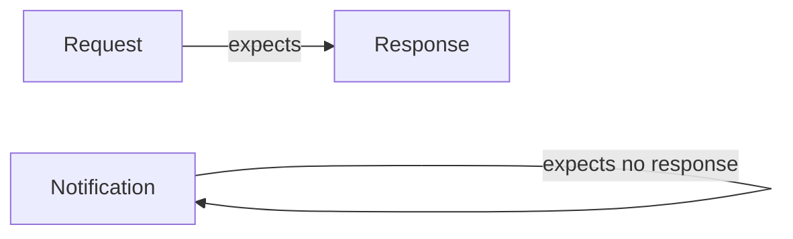
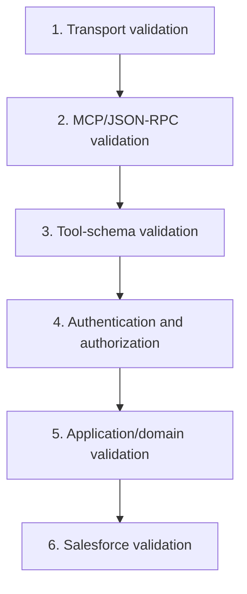
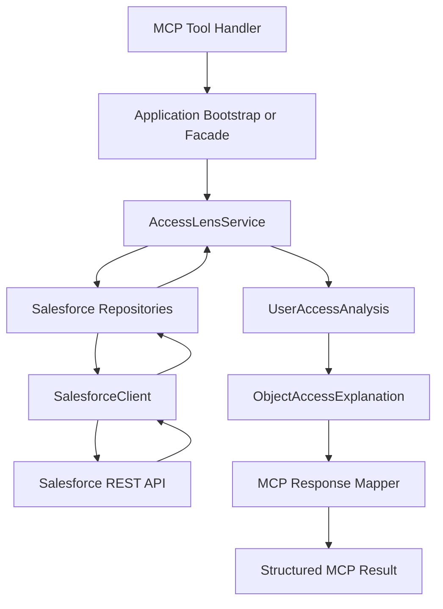
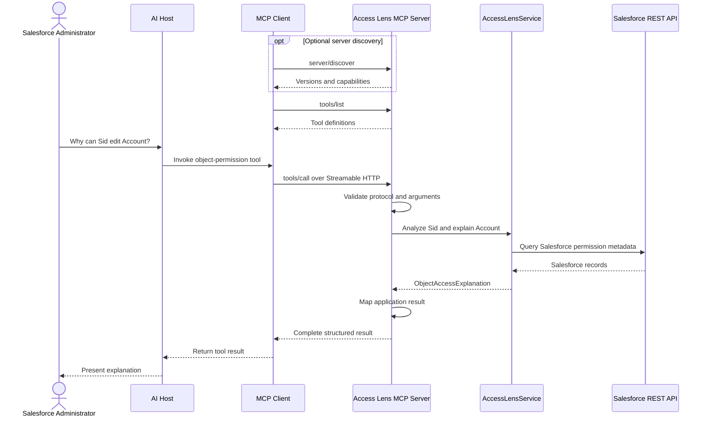
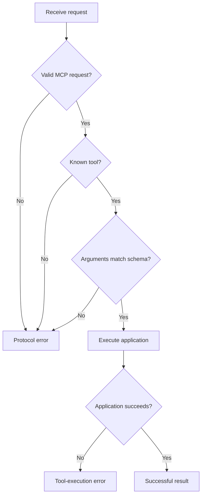

# Lesson 04: MCP Protocol Lifecycle

## Lesson Status

**Completed**

## Last Reviewed

21 August 2026

This lesson is aligned with MCP protocol revision:

```text
2026-07-28
```

## Learning Objectives

By the end of this lesson, we should be able to:

- explain the lifecycle of an MCP tool call;
- understand MCP requests, responses, and notifications;
- explain how JSON-RPC request identifiers work;
- distinguish server discovery from tool discovery;
- explain `server/discover`, `tools/list`, and `tools/call`;
- understand the current stateless protocol core;
- trace an Access Lens request from the client to Salesforce and back;
- identify the different validation boundaries;
- distinguish protocol errors from tool-execution errors;
- explain complete and input-required results;
- understand how explicit handles support cross-call state;
- identify which responsibilities belong to the MCP SDK;
- identify which responsibilities remain in our application.

---

# 1. What Is the MCP Protocol Lifecycle?

The protocol lifecycle describes how an MCP client and server interact.

For Salesforce Access Lens, the high-level lifecycle is:

```text
Optionally discover the server
        ↓
List available tools
        ↓
Make tool definitions available to the host/model
        ↓
Select a relevant tool
        ↓
Send a tool call
        ↓
Validate the request
        ↓
Execute Salesforce Access Lens
        ↓
Return a structured result or error
```

With MCP `2026-07-28`, these interactions do not require one permanent
protocol-level session.

Each request can be self-contained.

---

# 2. Important Protocol-Version Boundary

Older MCP revisions used a lifecycle resembling:

```text
Connect
    ↓
Send initialize
    ↓
Receive initialization response
    ↓
Send initialized notification
    ↓
Use protocol session
```

MCP `2026-07-28` removed:

- the mandatory `initialize` request;
- the `initialized` notification;
- protocol-level sessions;
- the `Mcp-Session-Id` header.

The current protocol uses self-describing requests.

A client may optionally discover the server before invoking another
operation, but discovery does not create a protocol session.

```text
Current behavior:
Independent, self-describing requests

Not:
Hidden session state shared across calls
```

---

# 3. MCP Uses JSON-RPC 2.0 Messages

MCP messages use JSON-RPC 2.0 structures.

The three principal message categories are:

```text
Requests
Responses
Notifications
```



---

# 4. Requests

A request asks another protocol participant to perform an operation.

A request expects a response.

Conceptual example:

```json
{
  "jsonrpc": "2.0",
  "id": 1,
  "method": "tools/list",
  "params": {}
}
```

## Request Fields

| Field | Purpose |
|---|---|
| `jsonrpc` | Identifies the JSON-RPC protocol version |
| `id` | Correlates the request with its response |
| `method` | Identifies the requested operation |
| `params` | Contains arguments for the operation |

A request identifier may be a string or number.

It must identify an outstanding request unambiguously.

---

# 5. Request Identifiers

Suppose a client sends several requests:

```json
{
  "jsonrpc": "2.0",
  "id": 101,
  "method": "tools/list"
}
```

and:

```json
{
  "jsonrpc": "2.0",
  "id": 102,
  "method": "resources/list"
}
```

The corresponding responses must preserve those identifiers.

```text
Response with id 101
    → belongs to tools/list

Response with id 102
    → belongs to resources/list
```

This allows multiple requests to be processed concurrently without
confusing their results.

The request identifier is protocol correlation data. It is not:

- a Salesforce user identifier;
- an Access Lens analysis identifier;
- an authentication token;
- an application-state handle.

---

# 6. Responses

A response is returned for a request.

It contains either:

```text
result
```

or:

```text
error
```

## Successful Response

```json
{
  "jsonrpc": "2.0",
  "id": 1,
  "result": {
    "resultType": "complete",
    "tools": []
  }
}
```

## Error Response

```json
{
  "jsonrpc": "2.0",
  "id": 1,
  "error": {
    "code": -32602,
    "message": "Invalid parameters."
  }
}
```

The response identifier matches the request identifier.

---

# 7. Notifications

A notification is a one-way message.

It does not expect a response.

Therefore, it does not contain a request identifier.

Conceptual example:

```json
{
  "jsonrpc": "2.0",
  "method": "notifications/tools/list_changed"
}
```

Notifications may communicate events such as a changed capability
list.

Our first Salesforce Access Lens server will expose a stable tool
catalog. It does not initially require dynamic tool-list notifications.

---

# 8. Request, Response, and Notification Comparison

| Characteristic | Request | Response | Notification |
|---|---|---|---|
| Contains `method` | Yes | No | Yes |
| Contains `id` | Yes | Matches request | No |
| Expects response | Yes | Not applicable | No |
| Contains operation parameters | Possibly | No | Possibly |
| Contains result or error | No | Yes | No |

---

# 9. Server Discovery

MCP `2026-07-28` provides:

```text
server/discover
```

It allows a client to learn information such as:

- supported protocol versions;
- broad server capabilities;
- server implementation information;
- instructions for using the server.

Conceptually:

```json
{
  "jsonrpc": "2.0",
  "id": "discover-1",
  "method": "server/discover",
  "params": {
    "_meta": {
      "io.modelcontextprotocol/protocolVersion": "2026-07-28",
      "io.modelcontextprotocol/clientInfo": {
        "name": "example-client",
        "version": "1.0.0"
      }
    }
  }
}
```

The SDK should construct the exact current request shape.

---

# 10. Discovery Is Optional

A client does not have to call `server/discover` before every other
operation.

It may already know:

- which protocol version to use;
- which operation to invoke;
- which server it is addressing.

The client can invoke an operation directly and handle an unsupported
protocol-version response if necessary.

Therefore:

```text
server/discover
    = optional discovery

server/discover
    ≠ mandatory initialization

server/discover
    ≠ creation of a protocol session
```

---

# 11. Server Discovery Compared with Tool Discovery

Server discovery and tool listing answer different questions.

## `server/discover`

Answers:

```text
Which protocol versions does this server support?
Which broad capabilities does it expose?
What server software is this?
```

## `tools/list`

Answers:

```text
Which specific tools are available?
What are their names?
What do they do?
What arguments do they accept?
```

For Salesforce Access Lens:

```text
server/discover
    → The server supports tools.

tools/list
    → explain_object_permissions
    → explain_field_permissions
```

---

# 12. Listing Tools

The client requests the tool catalog using:

```text
tools/list
```

Conceptual request:

```json
{
  "jsonrpc": "2.0",
  "id": 2,
  "method": "tools/list",
  "params": {}
}
```

Conceptual response:

```json
{
  "jsonrpc": "2.0",
  "id": 2,
  "result": {
    "resultType": "complete",
    "tools": [
      {
        "name": "explain_object_permissions",
        "description": "Explain a Salesforce user's object-level metadata permissions and their currently supported permission sources.",
        "inputSchema": {
          "type": "object",
          "properties": {
            "username": {
              "type": "string",
              "description": "Salesforce username to analyze."
            },
            "object_name": {
              "type": "string",
              "description": "Salesforce object API name."
            }
          },
          "required": [
            "username",
            "object_name"
          ],
          "additionalProperties": false
        }
      },
      {
        "name": "explain_field_permissions",
        "description": "Explain a Salesforce user's field-level metadata permissions and their currently supported permission sources.",
        "inputSchema": {
          "type": "object",
          "properties": {
            "username": {
              "type": "string"
            },
            "object_name": {
              "type": "string"
            },
            "field_name": {
              "type": "string"
            }
          },
          "required": [
            "username",
            "object_name",
            "field_name"
          ],
          "additionalProperties": false
        }
      }
    ]
  }
}
```

The list response contains tool definitions.

It does not analyze a Salesforce user.

---

# 13. Tool Listing Compared with Tool Calling

```text
tools/list
    → What can this server do?

tools/call
    → Perform one of those operations.
```

| Operation | Purpose | Calls Salesforce? |
|---|---|---|
| `tools/list` | Return capability metadata | Normally no |
| `tools/call` | Execute a selected tool | Our tools will |

This separation allows the host and model to understand the available
capabilities before invoking them.

---

# 14. Deterministic Tool Ordering

A server should return a stable tool order when the catalog has not
changed.

For example:

```text
1. explain_object_permissions
2. explain_field_permissions
```

should not randomly become:

```text
1. explain_field_permissions
2. explain_object_permissions
```

Stable ordering supports:

- predictable clients;
- reliable caching;
- improved prompt caching;
- simpler debugging;
- reproducible tests.

---

# 15. Tool-List Caching

Tool catalogs usually change less frequently than tool results.

The current protocol supports caching information on list operations.

A client may cache a tool list according to server-provided hints.

This prevents unnecessary repeated discovery.

Tool visibility may still vary based on authorization.

For example:

```text
Auditor authorization:
- explain_object_permissions
- explain_field_permissions

Administrator authorization:
- additional privileged tools
```

Tool availability should not vary due to hidden protocol-session state.

---

# 16. Making Tools Available to the Model

After obtaining tool definitions, the host can make the relevant tools
available to the language model.

The model sees information such as:

```text
Tool name
Description
Input schema
Output expectations
```

The model does not need to see:

- Salesforce credentials;
- JWT private keys;
- SOQL;
- repository classes;
- internal mappers;
- Salesforce access tokens.

Those remain behind the MCP server boundary.

---

# 17. Tool Selection

Suppose the user asks:

> Why can Sid edit Account?

The model may reason:

```text
The question concerns object-level Salesforce permissions.

The server exposes:
explain_object_permissions.

Required arguments:
username and object_name.
```

The host then manages the tool invocation through its MCP client.

The model suggesting the tool does not bypass:

- host policy;
- user approval;
- input validation;
- server authorization.

---

# 18. Calling a Tool

The client invokes a tool using:

```text
tools/call
```

Conceptual request:

```json
{
  "jsonrpc": "2.0",
  "id": 3,
  "method": "tools/call",
  "params": {
    "name": "explain_object_permissions",
    "arguments": {
      "username": "sid@example.com",
      "object_name": "Account"
    }
  }
}
```

This identifies:

```text
Protocol operation:
tools/call

Tool:
explain_object_permissions

Arguments:
username
object_name
```

---

# 19. Streamable HTTP Representation

Using Streamable HTTP, the JSON-RPC request is carried in an HTTP POST
request.

Conceptually:

```http
POST /mcp HTTP/1.1
Content-Type: application/json
Accept: application/json, text/event-stream
MCP-Protocol-Version: 2026-07-28
Mcp-Method: tools/call
Mcp-Name: explain_object_permissions
```

The request body contains the JSON-RPC message.

The exact implementation is handled by the MCP SDK.

---

# 20. Header and Body Agreement

Important operation information is reflected in HTTP headers.

For example:

```text
Header:
Mcp-Method: tools/call

Body:
"method": "tools/call"
```

and:

```text
Header:
Mcp-Name: explain_object_permissions

Body:
"name": "explain_object_permissions"
```

The header and body must agree.

## Why This Matters

A gateway may route or authorize using HTTP headers.

The MCP server may execute based on the request body.

If they disagree:

```text
Gateway authorizes one operation
Server executes another operation
```

That creates a security vulnerability.

Therefore, mismatched or missing required headers must be rejected.

---

# 21. Validation Boundaries

A tool call passes through several validation layers.



Each layer protects a different boundary.

---

# 22. Transport Validation

Transport validation may include:

- allowed HTTP method;
- accepted content type;
- request-size limits;
- required headers;
- header/body agreement;
- valid protocol-version header;
- accepted host name;
- TLS requirements in production.

The application layer should not implement these checks manually if the
server framework or SDK already handles them.

---

# 23. Protocol Validation

Protocol validation may include:

- valid JSON-RPC structure;
- valid request identifier;
- recognized MCP method;
- valid parameter structure;
- supported protocol revision;
- valid MCP metadata.

A malformed MCP request should not reach our application service.

---

# 24. Tool-Schema Validation

Schema validation checks whether tool arguments match the declared
contract.

For the object tool:

```text
username:
required string

object_name:
required string
```

Examples of schema failures:

```json
{
  "username": 123,
  "object_name": "Account"
}
```

or:

```json
{
  "object_name": "Account"
}
```

if `username` is required.

These are request/schema failures rather than failures discovered after
normal application execution.

---

# 25. Authentication and Authorization

Authentication answers:

> Who is calling this MCP server?

Authorization answers:

> What may that caller do?

For Salesforce Access Lens, authorization may eventually check:

- may the caller use the server?
- may the caller analyze this Salesforce org?
- may the caller inspect another user's permissions?
- may the caller access sensitive security metadata?
- which tools should this caller see?

The model deciding to call a tool is not authorization.

---

# 26. Application Validation

After a structurally valid and authorized tool request reaches our
application, domain validation still applies.

Examples include:

```python
Validation.validate_required(
    "object_name",
    object_name,
)
```

Application validation may identify:

- blank values;
- unsupported business operations;
- unknown Salesforce user;
- invalid domain relationship;
- unsupported permission source;
- inconsistent analysis data.

The MCP schema does not replace application invariants.

---

# 27. Salesforce Validation and Failures

Salesforce may reject or fail an operation because of:

- invalid or expired access token;
- inaccessible object;
- malformed SOQL;
- insufficient integration-user access;
- unavailable API endpoint;
- request limit exceeded;
- temporary platform failure.

These failures happen after a valid MCP tool begins execution.

They usually belong to tool-execution error handling.

---

# 28. Application Execution Path

After validation, the MCP handler delegates to Salesforce Access Lens.



The MCP handler should not individually coordinate every repository.

`AccessLensService` already owns that application use case.

---

# 29. Successful Tool Results

A successful tool result may contain:

- human-readable content;
- structured content;
- an optional declared output schema;
- other supported MCP content blocks.

Conceptual result:

```json
{
  "jsonrpc": "2.0",
  "id": 3,
  "result": {
    "resultType": "complete",
    "content": [
      {
        "type": "text",
        "text": "Sid can edit Account. Three supported permission sources contribute to Account access."
      }
    ],
    "structuredContent": {
      "username": "sid@example.com",
      "object_name": "Account",
      "has_access": true,
      "effective_permissions": {
        "read": true,
        "create": true,
        "edit": true,
        "delete": true
      },
      "source_count": 3
    }
  }
}
```

This is illustrative. We will design the final response contract during
implementation.

---

# 30. Structured and Text Content

Structured output helps:

- models interpret fields reliably;
- clients validate responses;
- n8n consume results;
- UIs render permission sources;
- audit systems store results.

Text content helps:

- human readability;
- clients with limited structured-output support;
- debugging.

Our result may provide both.

The structured representation should remain authoritative for
machine-readable behavior.

---

# 31. Complete Results

A result with:

```text
resultType = complete
```

indicates that the operation finished and the result is final.

Our first Access Lens calls should normally complete in one request:

```text
Receive username and permission target
        ↓
Query Salesforce
        ↓
Build explanation
        ↓
Return complete result
```

---

# 32. Input-Required Results

Some operations need additional information before they can finish.

The current protocol supports multi-round-trip input behavior.

Conceptually:

```text
Client calls tool
        ↓
Server needs missing user input
        ↓
Server returns input_required
        ↓
Host gathers the input
        ↓
Client retries the original operation
        ↓
Server completes the request
```

A possible future Access Lens example:

```text
The organization selector was omitted, but the caller has access to
multiple Salesforce organizations.
```

Our first tools will avoid unnecessary interactive complexity.

They will require their essential inputs upfront.

---

# 33. Protocol Errors

A protocol error means the request cannot be processed correctly as an
MCP operation.

Examples include:

- malformed JSON-RPC;
- unknown MCP method;
- unknown tool name;
- malformed `tools/call`;
- schema-invalid tool arguments;
- header/body mismatch;
- unsupported protocol version;
- internal protocol failure.

Conceptual error response:

```json
{
  "jsonrpc": "2.0",
  "id": 3,
  "error": {
    "code": -32602,
    "message": "Unknown tool: explain_account_stuff"
  }
}
```

This uses the top-level:

```text
error
```

No valid tool implementation began executing.

---

# 34. Tool-Execution Errors

A tool-execution error means:

```text
The MCP request identified a real tool and was structurally valid,
but the application operation could not complete.
```

Examples include:

- Salesforce user not found;
- Salesforce authentication failure;
- Salesforce API unavailable;
- API limit exceeded;
- business validation failure;
- invalid Salesforce object discovered during execution;
- repository or downstream service failure.

Conceptual result:

```json
{
  "jsonrpc": "2.0",
  "id": 3,
  "result": {
    "resultType": "complete",
    "content": [
      {
        "type": "text",
        "text": "Salesforce user was not found for username: missing@example.com"
      }
    ],
    "isError": true
  }
}
```

Because the model may correct an argument and retry, the error should
be safe and actionable.

---

# 35. Central Error-Distinction Rule

Ask:

> Did execution reach a valid tool implementation?

## If No

```text
Protocol error
```

Examples:

- tool does not exist;
- call structure is malformed;
- request does not match the schema.

## If Yes

Ask:

> Did the tool fail while performing its application operation?

If yes:

```text
Tool-execution error
```

Examples:

- user not found;
- Salesforce rejected the query;
- downstream service unavailable.

---

# 36. Error Classification Table

| Scenario | Classification | Reason |
|---|---|---|
| Unknown MCP method | Protocol error | MCP operation cannot be routed |
| Unknown tool name | Protocol error | No registered tool begins execution |
| Malformed JSON-RPC | Protocol error | Invalid protocol message |
| Header/body mismatch | Protocol/transport error | Request representation is inconsistent |
| Missing required schema argument | Request/schema error | Tool contract is not satisfied |
| Argument has wrong JSON type | Request/schema error | Input does not match tool schema |
| Valid username string but no user exists | Tool-execution error | Valid tool began application execution |
| Salesforce token rejected | Tool-execution error | Downstream failure during execution |
| Salesforce API temporarily unavailable | Tool-execution error | Downstream failure during execution |
| API request limit exceeded | Tool-execution error | Salesforce rejected an executing operation |
| Application invariant fails | Tool-execution error | Business operation cannot complete |
| Unexpected server crash | Internal server error | Server failed unexpectedly |
| Caller lacks permission | Authorization failure | Caller may not perform the operation |

Exact SDK exception mappings will be decided during implementation.

---

# 37. Why Unknown Tool Is a Protocol Error

Suppose the client sends:

```json
{
  "method": "tools/call",
  "params": {
    "name": "explain_account_stuff",
    "arguments": {}
  }
}
```

Our server exposes no such tool.

The lifecycle stops here:

```text
Receive tools/call
        ↓
Look for registered tool
        ↓
No matching tool
        ↓
Return protocol error
```

The lifecycle never reaches:

```text
AccessLensService
```

Therefore, it is not a tool-execution error.

---

# 38. Why Unknown Salesforce User Is a Tool-Execution Error

Suppose the client sends:

```json
{
  "method": "tools/call",
  "params": {
    "name": "explain_object_permissions",
    "arguments": {
      "username": "missing@example.com",
      "object_name": "Account"
    }
  }
}
```

The tool exists and the arguments are structurally valid.

The lifecycle proceeds:

```text
Resolve registered tool
        ↓
Begin tool execution
        ↓
Call AccessLensService
        ↓
Search Salesforce user
        ↓
User does not exist
        ↓
Return tool-execution error
```

The failure occurs inside a valid application operation.

---

# 39. Stateless Tool Calls

MCP `2026-07-28` does not provide hidden protocol-session state across
tool calls.

The server must not assume:

```text
The previous call analyzed Sid,
so the next call must also refer to Sid.
```

Instead, every call should contain the required context.

## Object Tool

```json
{
  "username": "sid@example.com",
  "object_name": "Account"
}
```

## Field Tool

```json
{
  "username": "sid@example.com",
  "object_name": "Account",
  "field_name": "AnnualRevenue"
}
```

Each operation is independently understandable.

---

# 40. Benefits of Self-Contained Calls

Self-contained calls improve:

- horizontal scaling;
- retry behavior;
- observability;
- auditability;
- testability;
- failure recovery;
- load balancing;
- clarity for the model;
- reproducibility.

A request can be logged and understood without reconstructing a hidden
conversation session.

---

# 41. Explicit Handles for Application State

Some applications genuinely need state across calls.

For example:

```text
Create an analysis snapshot
        ↓
Return analysis_handle
        ↓
Use analysis_handle in later operations
```

Conceptual creation result:

```json
{
  "analysis_handle": "analysis-123"
}
```

Conceptual later call:

```json
{
  "analysis_handle": "analysis-123",
  "object_name": "Account"
}
```

The handle is ordinary application data.

It is not a protocol session.

---

# 42. Handle Security

An explicit handle must be treated carefully.

The server should verify:

- the caller may use it;
- it belongs to the correct tenant or Salesforce org;
- it has not expired;
- it has not been revoked;
- it cannot be guessed;
- its underlying data still exists.

An authenticated handle is a reference, not automatic authorization.

Our first Access Lens version does not require handles.

Each tool can perform a fresh analysis.

---

# 43. Complete Access Lens Lifecycle



---

# 44. Error Lifecycle



Authorization failure handling may occur before application execution
and will be designed with the server's authentication model.

---

# 45. What the MCP SDK Should Handle

The SDK should handle protocol infrastructure such as:

- JSON-RPC encoding and decoding;
- operation routing;
- request identifiers;
- tool registration;
- schema integration;
- `tools/list`;
- `tools/call` dispatch;
- Streamable HTTP behavior;
- protocol metadata;
- response serialization;
- current protocol-version behavior;
- much of the transport and protocol validation.

We should use the SDK rather than manually recreating MCP wire logic.

---

# 46. What Our Application Must Handle

Our code remains responsible for:

- tool names;
- tool descriptions;
- input semantics;
- application bootstrapping;
- calling `AccessLensService`;
- Salesforce authentication;
- Salesforce repository behavior;
- permission analysis;
- response mapping;
- domain validation;
- authorization policy;
- safe tool-execution errors;
- logging and tracing;
- tests;
- protection of secrets.

The SDK does not design the Access Lens architecture for us.

---

# 47. Initial Lifecycle Design Decisions

We have decided:

1. Our tools will use self-contained inputs.
2. The object tool will require `username` and `object_name`.
3. The field tool will require `username`, `object_name`, and
   `field_name`.
4. We will not rely on protocol-level session state.
5. We will not introduce explicit analysis handles in the first version.
6. The server may support optional discovery through the SDK.
7. Tool definitions will be returned in deterministic order.
8. Tool results will be structured.
9. Unknown tool names will be treated as protocol errors.
10. Valid tools failing during Salesforce analysis will return safe,
    actionable tool-execution errors.
11. MCP handlers will delegate to the application layer.
12. The SDK will own wire-protocol implementation.
13. Application exceptions will not leak secrets or raw stack traces.
14. We will inspect actual messages using MCP Inspector during
    implementation.

---

# 48. Knowledge Check

## Question 1

The client calls:

```text
explain_account_stuff
```

but the tool does not exist.

### Answer

```text
Protocol error
```

No registered tool implementation begins executing.

## Question 2

The client successfully invokes:

```text
explain_object_permissions
```

but the Salesforce username does not exist.

### Answer

```text
Tool-execution error
```

A valid tool begins executing and then encounters an application-level
failure.

## Question 3

Why must every initial tool call include the username and target
object or field?

### Answer

MCP `2026-07-28` has no protocol-level session connecting one call to
another. Each call must be independently understandable and must not
depend on hidden state from a previous call.

---

# 49. Key Takeaway

```text
Discovery tells the client what is available.

tools/list describes the tools.

tools/call invokes one tool.

Validation protects each architectural boundary.

Protocol errors mean a valid tool could not be invoked.

Tool-execution errors mean a valid tool started but could not finish.

Every initial Access Lens tool call will be self-contained.
```

---

# References

- [MCP 2026-07-28 release](https://blog.modelcontextprotocol.io/posts/2026-07-28/)
- [MCP base protocol](https://modelcontextprotocol.io/specification/draft/basic)
- [MCP server discovery](https://modelcontextprotocol.io/specification/draft/server/discover)
- [MCP tools](https://modelcontextprotocol.io/specification/draft/server/tools)
- [MCP Streamable HTTP transport](https://modelcontextprotocol.io/specification/draft/basic/transports)
- [MCP schema reference](https://modelcontextprotocol.io/specification/draft/schema)

The MCP specification evolves quickly. The selected SDK's current
documentation should be checked before implementing exact wire-level
behavior.